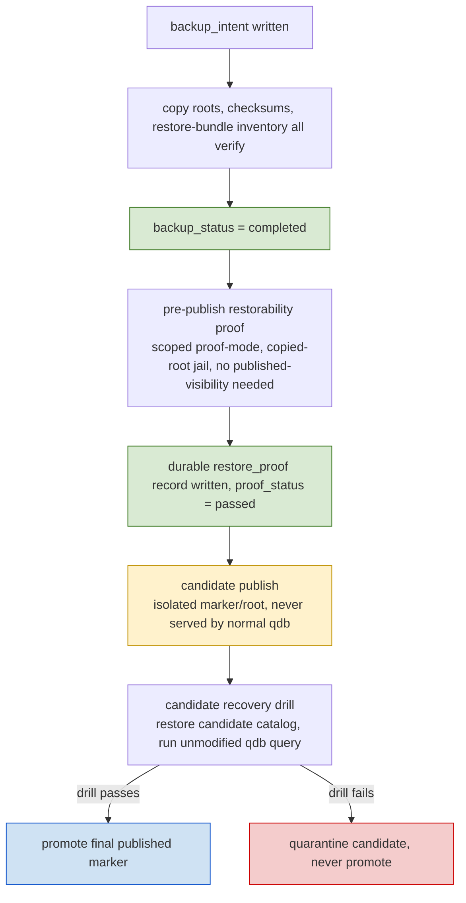

# CCC DuckLake v7.2.3 Ops Recovery Maintenance Security

Every postponed storage, restore, maintenance, observability, topology, or hardening item in this module follows DD-002, DD-011, DD-013, DD-017, DD-020, and DD-022 in [[PRJ-AI-CCC-DuckLake-v7.2.3-Deferred-Decision-Registry]]. A missing real-route probe keeps non-scratch targets unwritable; a missing maintenance proof keeps the operation uncallable; and missing operational evidence blocks the higher readiness claim rather than extending an open item forever.

This module is the v7.2.3 structural port for operational recovery, maintenance, retention, production-path refusal, safety, redaction, global observability, diagnosis, and pre-live operations. It preserves the v6.5.0 semantics that restore and cleanup are proof-bearing operational procedures, not optimistic catalog-only checks or hidden state transitions.

## Module Boundary

**Owns:** backup/restore operating procedures, copied-root restore operation, cleanup/retention operation, DuckLake maintenance wrapper choke point, maintenance `VERIFY::` sentinel resolution procedure, production-path and DSN refusal procedure, safety/secrets boundaries, global observability/logging/error taxonomy, event schema seed ownership, failed-run diagnosis schema ownership, pre-live topology/runbook/probe controls, ops-local tests, and operational readiness controls.

**Depends On:** [[PRJ-AI-CCC-DuckLake-v7.2.3-Publish-Control-Kernel]] for kernel state, `backup_marker`, `cleanup_eligibility`, `restore_proof`, transition legality, and visibility invariants; [[PRJ-AI-CCC-DuckLake-v7.2.3-Manifests-Lineage-And-Fixtures]] for immutable manifest shape, restore-bundle inventory shape, manifest file inventory, and fixture proof artifacts; [[PRJ-AI-CCC-DuckLake-v7.2.3-Provider-Capability-And-Availability]] for provider refusal and source-enable semantics; [[PRJ-AI-CCC-DuckLake-v7.2.3-QDB-Agent-Access-And-SQL-Zero]] for API-specific errors and query refusal surfaces; [[PRJ-AI-CCC-DuckLake-v7.2.3-Orchestration-And-QDBCTL]] for command/DAG triggers that invoke these procedures; [[PRJ-AI-CCC-DuckLake-v7.2.3-Verification-Benchmarks-Readiness]] for phase matrix, cross-index, benchmark gates, readiness checklist, and whole-system proof posture.

**Read After:** [[PRJ-AI-CCC-DuckLake-v7.2.3-Publish-Control-Kernel]], [[PRJ-AI-CCC-DuckLake-v7.2.3-Manifests-Lineage-And-Fixtures]], and [[PRJ-AI-CCC-DuckLake-v7.2.3-Orchestration-And-QDBCTL]].

**Non-Authoritative Restatements:** Kernel valid-state rules, final visibility, and transition preconditions are referenced here only to explain restore and cleanup procedures; [[PRJ-AI-CCC-DuckLake-v7.2.3-Publish-Control-Kernel]] remains authoritative. Manifest bundle/file-inventory shape is referenced but owned by [[PRJ-AI-CCC-DuckLake-v7.2.3-Manifests-Lineage-And-Fixtures]]. Provider live-adapter refusal semantics are linked, not redefined. API-specific `qdb` errors remain owned by [[PRJ-AI-CCC-DuckLake-v7.2.3-QDB-Agent-Access-And-SQL-Zero]]; this module owns global event/diagnosis taxonomy.

## Source Port

| Source | Ported content |
|---|---|
| Primary PRD 1017-1179 | Backup/restore/cleanup retention, durability chain, split-brain warning, maintenance wrapper choke point, `VERIFY::` sentinels, wrapper map, and sentinel resolution procedure. |
| Primary PRD 1388-1477 | Config validation table, default production-path refusal, scratch/project config seed, and realpath/DSN classifier code. |
| Primary PRD 1491, 1497-1502 where ops-facing | `REQ-STORAGE-PROBE`, config secret/path/destructive flag requirements, and `REQ-TEST-PG` support. |
| Primary PRD 1633-1672 | `REQ-MAINT-*`, `REQ-RESTORE-*`, `REQ-MON-*`, `REQ-OBS-SCHEMA`, `REQ-OBS-DEFER`, and minimum observability event schema seeds. |
| Primary PRD 1674-1732 | `REQ-OPS-*`, topology seed, pre-live command seeds, DSN/path classifier extensions, retention categories, and launch posture records. |
| Primary PRD 3761-3781 | Safety, secrets, redaction, and stable non-secret config names. |
| Primary PRD 3462-3707 where ops-local | Restore, maintenance, path refusal, monitoring, pre-live, redaction, and storage/retention tests. |
| Primary PRD 3936-3983 where ops-facing | Unresolved ops risks and readiness checklist items related to restore, Dagu, observability, cleanup, Testcontainers, source adapters, NAS, and storage probes. |

Table: v6.5.0 source ranges structurally ported into this module.

## Backup, Restore, And Cleanup Retention

Restoring the PostgreSQL catalog is insufficient if DuckLake data files, manifests, raw inputs, contracts, or validation artifacts were moved, compacted, deleted, or never durably synced. The recovery objective is restore to the last completed published batch, but proof must cover files, not only catalog rows.



Figure: the durability chain: completion is proven before `backed_up`, the pre-publish proof avoids the published-visibility deadlock, a durable `restore_proof` gates promotion, and the candidate recovery drill runs against an isolated candidate before the final published marker is promoted, so a failed drill never exposes bad data.

- The recovery objective is copied-root scratch restore to the last completed published batch; full PostgreSQL PITR and remapped-root restore are out of the first release unless promoted by a later PRD (`REQ-RESTORE-POLICY`, D11).
- Catalog backups use `pg_dump`/`pg_restore` for catalog data and `pg_dumpall --globals-only` for roles/globals, stored outside the live PostgreSQL data directory, and cover the kernel metadata in the same restore objective.
- Backup tooling is decided for the first release, not left open: the unified catalog+kernel database (`REQ-RESTORE-CATALOG-UNITY`) is backed up with `pg_dump -Fc` and restored with `pg_restore` into a fresh scratch database, so one dump recovers catalog + kernel as a coherent unit; the lake/artifact file root is backed up with restic: content-addressed, deduplicating, encrypted at rest, and callable from a Dagu child DAG. Phase 0 keeps the plain copied-root file copy on scratch for the restore proof, and restic graduates in at pre-live/live with no always-running service added. `restic` and `pg_dump` are recorded as version-pinned tools in `docs/version-pins.md`, and a backlog item verifies restic's hash-output format against the manifest inventory shape.
- Backup ordering is normative (`CX3`): run `pg_dump -Fc`/`pg_dumpall --globals-only` to a temporary file, compute the dump SHA-256, insert the `backup_marker` row into the LIVE catalog+kernel database with `backup_status = 'started'`, that checksum, and globals coverage, then back up/copy the dump and file roots; the marker flips to `backup_status = 'completed'` only after every copy, checksum, and restore-bundle inventory verify, and `manifested → backed_up` is reached only at `completed`. A crash after the `started` marker but before completion stays `started`, which is never `backed_up` and never publishable. A restored database cannot contain its own final marker row for the restore operation that created it; restore evidence lives as an external artifact plus, after the restored database is online, a new post-restore verification row. Backed by `test_backup_marker_written_after_dump_hash` and `test_crash_after_backup_marker_before_file_copy_does_not_mark_backed_up_or_publish`.
- Pre-live backup command contract (`OP5`): the repo ships runbooks and Task targets for `restic init`, `restic snapshots`, `restic backup`, `restic restore`, `pg_dump`, `pg_restore`, and `pg_dumpall --globals-only`, all with version-pinned binaries, scratch `RESTIC_PASSWORD` in tests, and redacted secret handling. `backup_marker` records `restic_repo_id`, `restic_snapshot_id`, `pg_dump_sha256`, `pg_dumpall_globals_sha256`, and the restore-evidence path when those tools are active.
- Restore cadence is phase-bound (`OP6`): Phase 0 proves copied-root scratch restore on every publish; pre-live proves copied-root restore on the first NAS publish and after schema/pin/cleanup/backup-tool changes; live v1 binds manifest plus backup marker per publish but runs full restore drills by TTL/change trigger rather than forcing every high-frequency partition through a full restore.
- Retention and DR are explicit (`OP5`, `OP7`): `config/retention.yaml` defines snapshot/file/catalog/artifact windows plus cleanup approval-hash format, and the local DR boundary is honest: v1 recovers the last published batch if catalog backups and file/artifact backups survive; total NAS loss requires an external/offline restic copy. The pre-live runbook set is `docs/runbooks/bootstrap.md`, `topology.md`, `postgres.md`, `dagu.md`, `storage-probe.md`, `publish.md`, `restore.md`, `cleanup.md`, `failure-diagnosis.md`, `secrets-redaction.md`, and `dr.md`.
- Every catalog backup links to a manifest ID, DuckLake snapshot ID, catalog identity, lake root ID, restore mode, code version, contract version, backup checksum, global-object coverage, and restore evidence.
- Every publish manifest records a snapshot-derived file inventory: root identity, relative paths, table identity, file sizes, feasible content hashes, delete-file metadata if applicable, and the inventory source (`REQ-RESTORE-INVENTORY`, D12); `backup_id` and the cleanup-protection window are post-seal lifecycle facts in the kernel `backup_marker`/`cleanup_eligibility` tables joined by `manifest_id`, never embedded in the immutable manifest (`REQ-LIN-05`, manifest v3).
- File retention and cleanup must protect files referenced by any backup still inside the accepted restore window. Physical Parquet files outlive their catalog backups by an explicit retention gap so restores never reference ghost files.
- The CCC sentinel wrapper `qdb_lake.maintenance.cleanup_old_files` and orphan deletion default to dry-run; deletion requires a dry-run artifact, manifest cross-check, backup-reference guard, current-snapshot guard, cleanup-protection-window guard, an approval hash, and a post-cleanup validation query (`REQ-MAINT-02`, D13). No bare DuckLake function name is asserted as fact here: `cleanup_old_files`'s underlying call is `VERIFY::cleanup_old_files`, an unverified sentinel until `task verify:ducklake-api` binds it against the pinned DuckDB/DuckLake build (see [[PRJ-AI-CCC-DuckLake-v7.2.3-Ops-Recovery-Maintenance-Security#Resolving The VERIFY:: Sentinels]]).
- Restore drills run against scratch/fresh copied-root catalog state and prove table list, row counts, file existence (size/hash where feasible), manifest/backup linkage, lake-root policy, cleanup protection, and one known PIT `qdb` query. The pre-publish restorability proof runs in scoped proof-mode, and the candidate recovery drill runs against the isolated candidate marker/root before the final published marker is promoted; both run under the copied-root jail — the drill subprocess's lake root and catalog DSN point at the copy AND the original root/DSN are injected into that process's `prod_path_roots`/`prod_catalog_hosts` deny set, so touching the original raises `ProductionPathRefusedError` (FBL2-14) — and fail if any absolute live-root path leaks into the restored catalog, manifest, restore bundle, logs, or lineage.

> [!warning] Split-brain is the recovery failure mode to design against
> DuckLake removes old files through separate maintenance operations, so a catalog backup without a matching immutable file manifest and a cleanup-retention gap can restore a catalog that points at compacted, deleted, moved, or never-synced files. The v1 restore contract is copied-root scratch restore; same-root restore may be used only as a convenience smoke, and remapped-root restore is deferred until package behavior is proven.

## External DuckLake/DuckDB Maintenance API Reference

Every DuckLake/DuckDB snapshot-introspection and file-maintenance call goes through exactly one module, `src/qdb_lake/maintenance.py`. Nothing else in the codebase may call a `ducklake_*` function directly. This is the only way to keep the file-inventory, cleanup, snapshot-expiry, and flush operations honest, because their real names and signatures are not verified facts in the PRD and must be bound once, in one place, against the pinned DuckDB/DuckLake build at repo creation.

> [!warning] The snapshot file-listing function name is unreconciled and MUST NOT be guessed
> Earlier planning referred to the snapshot file-listing routine inconsistently; the first candidate is the table-scoped `ducklake_list_files`, and no snapshot-wide variant is asserted as real. Candidate names collapse into one wrapper, `qdb_lake.maintenance.list_snapshot_files`, and the real underlying call is resolved in code by `task verify:ducklake-api`, which runs `scripts/probe_ducklake_api.py` against the pinned DuckDB/DuckLake build and emits the committed `src/qdb_lake/generated_ducklake_bindings.py`. Until that probe passes, the underlying-name constants below are deliberately invalid sentinels so an unverified call fails loudly instead of silently binding to a wrong name; CI fails if any `VERIFY::` sentinel survives before a manifest is sealed. See [[PRJ-AI-CCC-DuckLake-v7.2.3-Ops-Recovery-Maintenance-Security#Resolving The VERIFY:: Sentinels]] below for how each sentinel is resolved in code.

```python
 # src/qdb_lake/maintenance.py
 # The single choke point for DuckLake/DuckDB snapshot introspection and file maintenance.
from __future__ import annotations
import dataclasses

 # Sentinels, NOT verified API. `task verify:ducklake-api` confirms the real names against the pinned DuckDB/DuckLake build and replaces these four strings; until then any call raises rather than binding to a guessed name.
_FN_SNAPSHOT_FILE_LISTING = "VERIFY::snapshot_file_listing"   # first candidate is table-scoped ducklake_list_files; exact signature verified by probe
_FN_CLEANUP_OLD_FILES     = "VERIFY::cleanup_old_files"
_FN_EXPIRE_SNAPSHOTS      = "VERIFY::expire_snapshots"
_FN_FLUSH_INLINED         = "VERIFY::flush_inlined_data"
 # BT2: Phase 0 binds and smoke-calls the maintenance subset that can affect the fixture publish/restore loop.
_FN_MERGE_ADJACENT_FILES  = "VERIFY::merge_adjacent_files"
_FN_REWRITE_DATA_FILES    = "VERIFY::rewrite_data_files"
_FN_DELETE_ORPHANED_FILES = "VERIFY::delete_orphaned_files"


@dataclasses.dataclass(frozen=True)
class SnapshotFile:
    relative_path: str
    lake_root_id: str
    size_bytes: int | None
    content_hash: str | None
    hash_status: str
    hash_reason: str | None


@dataclasses.dataclass(frozen=True)
class CleanupReport:
    dry_run: bool
    candidate_keys: list[str]
    deleted_keys: list[str]


def list_snapshot_files(conn, snapshot_id: str, lake_root_id: str, *, tables=None) -> list[SnapshotFile]:
    """Immutable file inventory for one snapshot. The ONLY supported way to build a publish manifest's file inventory or to verify files at restore time. Underlying call == _FN_SNAPSHOT_FILE_LISTING. BT3: current DuckLake docs show the file-listing function as TABLE-SCOPED, so this wrapper iterates the manifest's `tables` deterministically rather than assuming a single snapshot-wide function. If no such function exists in the pinned build, the probe binds this wrapper to a direct query of the DuckLake metadata `ducklake_data_file` catalog table as the explicit fallback inventory source."""
    raise NotImplementedError("bind to the verified DuckLake file-listing call (function or metadata-table fallback) at repo creation")


def flush_inlined_data(conn) -> None:
    """Flush/checkpoint inlined rows into Parquet so the file inventory is complete before a manifest is sealed. A manifest may record inlined_row_count: 0 only after this returns. Underlying call == _FN_FLUSH_INLINED."""
    raise NotImplementedError("bind to the verified DuckLake flush/checkpoint call at repo creation")


def cleanup_old_files(conn, *, dry_run: bool = True) -> CleanupReport:
    """Delete files no longer referenced by any live snapshot. Dry-run by default; real deletion is gated by the REQ-MAINT-02 approval chain."""
    raise NotImplementedError("bind to the verified DuckLake cleanup call at repo creation")


def expire_snapshots(conn, *, older_than, dry_run: bool = True) -> CleanupReport:
    """Expire snapshots older than a bound. Dry-run by default; same approval chain as cleanup."""
    raise NotImplementedError("bind to the verified DuckLake snapshot-expiry call at repo creation")


def merge_adjacent_files(conn, *, dry_run: bool = True) -> CleanupReport:
    """Compact small adjacent Parquet files. BT2: bind to _FN_MERGE_ADJACENT_FILES or explicitly defer this op out of Phase 0 maintenance in the backlog. Dry-run by default; real compaction is a wide-lock op under REQ-WRITE-SERIAL."""
    raise NotImplementedError("bind to the verified DuckLake merge call, or defer out of Phase 0 maintenance")


def rewrite_data_files(conn, *, dry_run: bool = True) -> CleanupReport:
    """Rewrite data files (re-partition/re-cluster). BT2: bind to _FN_REWRITE_DATA_FILES or explicitly defer out of Phase 0 maintenance in the backlog. Dry-run by default; wide-lock op."""
    raise NotImplementedError("bind to the verified DuckLake rewrite call, or defer out of Phase 0 maintenance")


def delete_orphaned_files(conn, *, dry_run: bool = True) -> CleanupReport:
    """Delete files not referenced by any snapshot. BT2: bind to _FN_DELETE_ORPHANED_FILES or explicitly defer out of Phase 0 maintenance. Dry-run by default; gated by the same REQ-MAINT-02 approval chain as cleanup_old_files."""
    raise NotImplementedError("bind to the verified DuckLake orphan-delete call, or defer out of Phase 0 maintenance")
```

Listing: The single DuckLake maintenance wrapper (`REQ-MAINT`, `REQ-RESTORE-INVENTORY`). Underlying names are sentinels until verified. The Phase 0 binding subset is exact: `list_snapshot_files`, `flush_inlined_data`, `cleanup_old_files` dry-run, and `expire_snapshots` dry-run must bind and smoke-call before a manifest can seal; `merge_adjacent_files`, `rewrite_data_files`, and `delete_orphaned_files` are present but may remain explicit backlog deferrals unless a Phase 0 DAG calls them. `task verify:ducklake-api` fails if code calls a deferred wrapper. Checkpoint/flush semantics are covered by `flush_inlined_data`.

| Wrapper | Underlying DuckLake call (verify before binding) | Purpose | Verification item |
|---|---|---|---|
| `list_snapshot_files` | `_FN_SNAPSHOT_FILE_LISTING` (reconciles historical naming drift) | Build/verify manifest file inventory | Confirm exact name + signature against pinned build |
| `flush_inlined_data` | `_FN_FLUSH_INLINED` | Flush inlined rows before sealing a manifest | Confirm flush/checkpoint pragma or function |
| `cleanup_old_files` | `_FN_CLEANUP_OLD_FILES` | Gated orphan-file deletion | Confirm `ducklake_cleanup_old_files` signature + dry-run flag |
| `expire_snapshots` | `_FN_EXPIRE_SNAPSHOTS` | Gated snapshot expiry | Confirm snapshot-expiry pragma/function |
| `merge_adjacent_files` | `_FN_MERGE_ADJACENT_FILES` | Compact adjacent files (wide lock) | Confirm merge function/signature, or defer out of Phase 0 (BT2) |
| `rewrite_data_files` | `_FN_REWRITE_DATA_FILES` | Rewrite/re-cluster data files | Confirm rewrite function/signature, or defer out of Phase 0 (BT2) |
| `delete_orphaned_files` | `_FN_DELETE_ORPHANED_FILES` | Gated orphan-file deletion | Confirm orphan-delete function/signature, or defer out of Phase 0 (BT2) |

Table: Wrapper-to-underlying map; every underlying cell is a verification item, never an asserted signature.

## Resolving The `VERIFY::` Sentinels

The seven wrapper sentinels are resolved, bound, or explicitly deferred by code, never by guessing and never by silent runtime self-mutation. The authoritative seven-name enumeration (`list_snapshot_files`, `flush_inlined_data`, `cleanup_old_files`, `expire_snapshots`, `merge_adjacent_files`, `rewrite_data_files`, `delete_orphaned_files`; Phase-0 binding subset = the first four, dry-run only for `cleanup_old_files`/`expire_snapshots`) lives in [[PRJ-AI-CCC-DuckLake-v7.2.3-Provider-Capability-And-Availability]]'s `ducklake_maintenance_fn_names` backlog item; this module restates the list for local readability but does not own it. `task verify:ducklake-api` runs `scripts/probe_ducklake_api.py`, which queries the pinned DuckDB/DuckLake build, records the result in `docs/runtime-verification/ducklake_api.json` with an `observed_output_hash`, and emits a deterministic, committed `src/qdb_lake/generated_ducklake_bindings.py` for the Phase 0 subset. The probe resolves each required wrapper deterministically: it matches probed `duckdb_functions()` names against an ordered candidate pattern (required name tokens, forbidden tokens, expected argument arity, and a scratch smoke call) and binds only when exactly one candidate matches. Zero or more-than-one matches fail closed and write an `investigate` backlog record instead of guessing. `src/qdb_lake/maintenance.py` imports those generated bindings; nothing else resolves a `ducklake_*` name. CI fails if any Phase 0 binding sentinel survives in a code path a manifest seal depends on, or if code calls a wrapper marked as a Phase 0 deferral.

DuckDB ASOF joins are a real primitive that the modeling-interface panel path may use, but ASOF alignment alone is never PIT safety: `qdb` MUST still enforce bitemporal validity and `source_available_at <= known_at` on every cell, regardless of how the underlying join is expressed.

## Config Validation

| Variable | Type | Required | Allowed path class | Test default | May point to production? |
|---|---|---|---|---|---|
| `QDB_LAKE_ROOT` | path/URI | yes | durable lake root | temp scratch dir | only with `QDB_ENABLE_NON_SCRATCH_STORAGE` + live flag |
| `QDB_LOCAL_SCRATCH` | path | yes | local NVMe scratch | temp dir | n/a |
| `QDB_ARTIFACT_ROOT` | path | yes | manifests/validation/restore evidence | temp scratch dir | only with `QDB_ENABLE_NON_SCRATCH_STORAGE` + live flag |
| `QDB_DUCKLAKE_CATALOG_DSN` | DSN | yes | scratch catalog in tests | scratch catalog | only with `QDB_ENABLE_NON_SCRATCH_STORAGE` + live flag |
| `QDB_POSTGRES_BACKUP_ROOT` | path | yes | backup destination | temp scratch dir | only with `QDB_ENABLE_NON_SCRATCH_STORAGE` + live flag |
| `QDB_DEFAULT_QUERY_TIMEOUT_SECONDS` | int | yes | n/a | small test value | n/a |
| `QDB_DEFAULT_ROW_LIMIT` | int | yes | n/a | small test value | n/a |
| `QDB_DEFAULT_BYTE_LIMIT` | int | yes | n/a | small test value | n/a |
| `QDB_ENABLE_LIVE_SOURCES` | bool | yes | n/a | false | gate for live provider/vendor downloads and live adapters only; never a storage gate |
| `QDB_ENABLE_NON_SCRATCH_STORAGE` | bool | yes | n/a | false | gate for non-scratch NAS lake/artifact/backup roots and the real catalog DSN, independent of live-source enablement |
| `QDB_ENABLE_RETRIEVAL` | bool | yes | n/a | false | feature flag, off in core verify |
| `QDB_ENABLE_SQL_EXPERT_MODE` | bool | yes | n/a | false | still restricted to contract-generated PIT-safe views/functions if enabled |
| `QDB_DAGU_HOME` | path | optional | Dagu state | temp dir | n/a |
| `QDB_TEST_POSTGRES_DSN` | DSN | optional | integration-test catalog override | unset (Testcontainers used) | test-only; never a production catalog |
| `QDB_ACTIVE_PHASE` | enum | optional | n/a | unset (`qdb_project.yaml` `active_phase` governs) | n/a; one-command phase override for `task verify`, values `phase0`, `phase1`, `iface`, `options`, `retrieval`, `prelive` (FBL2-22) |

Table: Config contract with scratch-only defaults and production-path refusal.

`QDB_DEFAULT_ROW_LIMIT` is a hard ceiling consumed by `qdb`: the effective row limit is `min(row_limit, QDB_DEFAULT_ROW_LIMIT)` (FBL2-16; see the shared conventions in [[PRJ-AI-CCC-DuckLake-v7.2.3-QDB-Agent-Access-And-SQL-Zero]]).

> [!important] Default refusal of production paths
> Default tests fail if `QDB_LAKE_ROOT`, `QDB_ARTIFACT_ROOT`, `QDB_POSTGRES_BACKUP_ROOT`, or `QDB_DUCKLAKE_CATALOG_DSN` resolve to production-looking NAS paths or the live catalog unless `QDB_ENABLE_NON_SCRATCH_STORAGE` plus the explicit live flag are present. Cleanup, restore, orphan deletion, and production publish promotion refuse to run without the storage gate and approval flags; live source download refuses without `QDB_ENABLE_LIVE_SOURCES` and its provider gates. Storage enablement and live-source enablement are independent axes: a NAS storage/smoke drill on `synthfix` fixtures may open the storage gate while live sources stay off, and opening the storage gate never implies vendor data may flow (`test_storage_flag_and_live_source_flag_are_independently_gateable`).

The classifier roots and hosts come from a committed `qdb_project.example.yaml` copied to a machine-local `qdb_project.yaml`. Phase 0 needs only `scratch_roots`; `prod_path_roots` and `prod_catalog_hosts` stay empty until pre-live, so the default posture is closed and the agent never has to guess Ryan's real NAS roots or catalog hosts from the PRD.

```yaml
 # qdb_project.example.yaml  (copy to qdb_project.yaml; Phase 0 uses scratch only)
scratch_roots:
  - /tmp/qdb-scratch
prod_path_roots: []
prod_catalog_hosts: []
scratch_dsn_endpoints:
  - 127.0.0.1:<testcontainers-port>
 # Refusal examples asserted in tests:
 #   QDB_LAKE_ROOT=/Volumes/nas/ducklake -> ProductionPathRefusedError unless that root is in prod_path_roots AND the live flag is present
 #   QDB_DUCKLAKE_CATALOG_DSN host listed in prod_catalog_hosts but no --i-understand-this-touches-real-data -> refused
```

#### Production-Path Classifier

The refusal above is enforced by one function that resolves real paths before classifying them, so a symlink or mount into a production root cannot evade a string check. Deny-list and allow-list are evaluated against resolved paths; there is exactly one storage escape, gated on the storage toggle (`QDB_ENABLE_NON_SCRATCH_STORAGE`) plus an explicit CLI flag. Live-source enablement (`QDB_ENABLE_LIVE_SOURCES`) is a separate axis that never unlocks a path or DSN by itself.

```python
 # src/qdb_config/path_guard.py
import os

class ProductionPathRefusedError(RuntimeError):
    """Raised when a path or DSN resolves into a production surface without the live escape."""

_PROD_PATH_ROOTS: tuple[str, ...] = ()
_PROD_CATALOG_ENDPOINTS: frozenset[str] = frozenset()
_SCRATCH_DSN_ENDPOINTS: frozenset[str] = frozenset()
_SOURCES_ENV = "QDB_ENABLE_LIVE_SOURCES"          # gates live provider/vendor downloads only
_STORAGE_ENV = "QDB_ENABLE_NON_SCRATCH_STORAGE"   # gates non-scratch paths and the real catalog DSN
_LIVE_FLAG = "--i-understand-this-touches-real-data"

def _under(real_path: str, root: str) -> bool:
    rroot = os.path.realpath(root)
    return real_path == rroot or real_path.startswith(rroot + os.sep)

def assert_path_is_safe(path: str, *, storage_enabled: bool, live_flag_present: bool, allow_roots: tuple[str, ...] = (), scratch_roots: tuple[str, ...] = ()) -> None:
    real = os.path.realpath(path)
    allowed_roots = allow_roots + scratch_roots
    if any(_under(real, a) for a in allowed_roots):
        return
    escape = storage_enabled and live_flag_present
    if any(_under(real, r) for r in _PROD_PATH_ROOTS):
        if escape:
            return
        raise ProductionPathRefusedError(f"refused production path: {real}")
    if real.startswith("/Volumes/") and not escape:
        raise ProductionPathRefusedError(f"refused external mount: {real}")
    if escape:
        return
    raise ProductionPathRefusedError(f"refused non-scratch local path: {real}")

def assert_dsn_is_safe(dsn_endpoint: str, *, storage_enabled: bool, live_flag_present: bool, test_dsn_marker_present: bool = False) -> None:
    if dsn_endpoint in _SCRATCH_DSN_ENDPOINTS and test_dsn_marker_present:
        return
    escape = storage_enabled and live_flag_present
    if dsn_endpoint in _PROD_CATALOG_ENDPOINTS and not escape:
        raise ProductionPathRefusedError(f"refused live catalog endpoint: {dsn_endpoint}")
    if dsn_endpoint.startswith("127.0.0.1:") and not test_dsn_marker_present and not escape:
        raise ProductionPathRefusedError(f"refused localhost catalog endpoint without QDB_TEST_POSTGRES_DSN marker: {dsn_endpoint}")
    if dsn_endpoint not in _SCRATCH_DSN_ENDPOINTS and not escape:
        raise ProductionPathRefusedError(f"refused non-scratch catalog endpoint: {dsn_endpoint}")
    return
```

Listing: Production-path classifier (`REQ-CFG-05`, raises `ProductionPathRefusedError`). Real-path resolution precedes classification; mutating paths are default-closed unless they resolve under configured `scratch_roots`/explicit `allow_roots` or the live escape is present. The DSN classifier is port- and marker-aware (`OP3`) so `127.0.0.1:5432` is refused unless it is the explicit Testcontainers/`QDB_TEST_POSTGRES_DSN` endpoint. The storage escape requires both `QDB_ENABLE_NON_SCRATCH_STORAGE` and the explicit flag; `QDB_ENABLE_LIVE_SOURCES` gates live provider downloads and adapters only and never unlocks a path or DSN by itself. Message architecture (FBL2-02): `ProductionPathRefusedError.__str__` prepends the pinned `REQ-QDB-ERRORS` sentence — "This call targets a path or DSN classified as production; refused — the dual-gated live escape is not engaged." — to the per-site detail; the per-site f-strings above (`refused production path: {real}` and its siblings) are diagnostic suffix detail, not the contract substring. This is how `test_qdb_error_substrings_match_contract` is satisfiable against these seeded raise-sites.

## Operational Requirements

- `REQ-STORAGE-PROBE` (restatement — the governing bullet lives in [[PRJ-AI-CCC-DuckLake-v7.2.3-Provider-Capability-And-Availability]] under the `REQ-STORAGE` family; FBL2-17b): no non-scratch NAS lake, artifact, or backup root may be used until the pre-live storage capability probe records the route, mount-option, path-equivalence, atomic-rename, temp-file, checksum-after-rename, read-after-close, listing-latency, file-count, free-space, disconnect-mid-write, and restore-copy facts enumerated there. Phase 0 requires only the scratch/non-scratch path classifier; the full two-host NAS drill is a pre-live gate, not a Phase 0 blocker. Ops owns the probe's operational procedure and artifacts; Provider owns the requirement bullet. SMB/NFS file locking on the NAS is explicitly NOT relied on for write serialization: the PostgreSQL advisory-lock protocol in [[PRJ-AI-CCC-DuckLake-v7.2.3-Publish-Control-Kernel]] is the sole single-writer authority, and NAS-level locking is at most defense-in-depth against a kernel-lock bypass, never the primary guard.
- `REQ-CFG-03`: Configuration MUST separate non-secret paths/settings from secret material; secrets MUST NOT be committed or printed.
- `REQ-CFG-05`: Config validation MUST enforce types, required/optional status, allowed path class, and scratch-only defaults, and MUST refuse production paths/DSNs in default tests without an explicit live flag.
- `REQ-CFG-06`: All destructive or live-data commands MUST require explicit flags.
- `REQ-CFG-08` (`REQ-TEST-PG`): Default integration tests MUST use pinned Testcontainers PostgreSQL 16; unit tests MUST NOT require Docker; integration tests MUST require Docker preflight or explicit `QDB_TEST_POSTGRES_DSN`; tests MUST NOT silently use `localhost:5432`; failures MUST distinguish unavailable test infrastructure from failed system invariants.

## DuckLake Maintenance (`REQ-MAINT`)

- `REQ-MAINT-01`: Maintenance MUST cover flush inlined data, expire snapshots, merge adjacent files, rewrite data files when appropriate, cleanup old files, and orphan-file deletion, with an applicability matrix by table class and recorded skip reasons.
- `REQ-MAINT-02`: Snapshot expiry MUST have a named retention policy and be dry-run capable; cleanup/orphan deletion MUST default to dry-run, and any actual deletion MUST require a safety record containing the cleanup command, pinned DuckDB/DuckLake versions, dry-run file set, manifest cross-check, backup-reference guard, current-snapshot guard, cleanup-protection-window guard, an approval hash, and a post-cleanup validation query. The `approval_hash` preimage is the RFC 8785 canonical JSON of the dry-run candidate delete set with its guard results (FBL2-24); `qdbctl cleanup --approve <hash>` recomputes the candidate set at delete time and refuses on any drift from the approved hash, closing the dry-run-to-delete TOCTOU window.
- `REQ-MAINT-INLINE`: DuckLake inlining MUST be configured with recorded limits and inlined-row counts; first-release default is `data_inlining_row_limit=0` unless a pinned-version proof enables inlining. A flush/checkpoint MUST run and be proven before any catalog backup and before scale.
- `REQ-MAINT-03`: Maintenance jobs MUST emit before/after metrics and MUST NOT run concurrently with publish jobs for the same tables; retained snapshots MUST still query correctly afterward.
- `REQ-MAINT-04`: Cleanup MUST refuse to delete any file or snapshot that an active research session pin still depends on. Before any deletion, `cleanup_old_files` and snapshot expiry MUST join the candidate delete set against open `session_pin_id` records and treat every manifest and its file inventory referenced by an active pin as ineligible for deletion, even if that manifest is superseded or otherwise past its retention window. The cleanup CLI refuses and emits a diagnosis artifact naming the blocking `session_pin_id`. Backed by `test_cleanup_refuses_file_referenced_by_active_session_pin`.
- `REQ-MAINT-05` (archive-before-delete): Agents are encouraged to archive rather than delete wherever the rules below prove safety; physical deletion remains the last resort. Archive means a reversible move/copy/quarantine plus a metadata record, never physical destruction. Every archive action MUST record the exact target set, reason, original path, archive path, batch/cleanup ID where applicable, SHA-256 or `hash_status`, timestamp, and restore instructions. Archive without a human approval hash is allowed only for generated scratch, candidate, and diagnostic artifacts, and only after guards prove that no active manifest, no open session pin, no raw/bronze/silver evidence, no required backup inside the accepted restore window, and no currently published view depends on the targets. Raw, bronze, silver, source evidence, manifests, and provider capability evidence are NEVER silently archived for convenience — moving anything in those classes is a Ryan-approved operation. Physical deletion is unchanged by this rule: it still requires the `REQ-MAINT-02` dry-run artifact, guard results, approval hash, and Ryan approval. Backed by `test_archive_action_records_required_metadata_and_refuses_protected_classes`.
- `REQ-MAINT-06` (v7.2.3, exhaust retention classes): the generated-artifact bucket in `REQ-MAINT-05` becomes enumerable. Retention classes and sweep rules: `committee_checkpoint` (`analysis/committee/<gate>/*`) sweeps after gate ratification plus 90 days, archive-before-delete; `diagnosis_bundle` (`failed_run_diagnosis` artifacts) sweeps after 30 days if its batch is not quarantined, archive-before-delete; `scratch_output` is ephemeral once its batch reaches `published` or `quarantined` and is exempt from archive-before-delete under the existing scratch exemption; `benchmark_record` is never swept (`REQ-BENCH-FREEZE` record-only posture). Every sweep obeys all `REQ-MAINT-05` guards. Backed by `test_retention_class_committee_checkpoint_sweeps_after_ratification_plus_90d` (prelive), `test_retention_class_scratch_output_is_exempt_from_archive_before_delete`, and `test_benchmark_record_class_never_swept_matches_bench_freeze_posture` (Verification-owned). Rationale: the archive-frozen predecessor accumulated a 5.8 GB un-swept exhaust archive; enumerated classes keep archives from becoming landfill.
- `REQ-MAINT-07` (v7.2.3, exhaust budget alarm): each retention class carries a configured on-disk size and file-count budget; crossing a budget emits a `retention_sweep_event` whose `budget_status` field reads `budget_exceeded`, delivered through the ordinary event stream — a structured event, never a metrics stack (`REQ-OBS-DEFER` unchanged). Backed by `test_retention_sweep_budget_alarm_emits_structured_event_not_metrics_call`.

## Backup, Restore, And Recovery (`REQ-RESTORE`)

- `REQ-RESTORE-POLICY`: The first-release restore proof MUST use copied-root scratch restore. The immutable manifest MUST record `lake_root_id`, `file_inventory_mode`, `ducklake_snapshot_id`, relative paths, file size, content hash and `hash_status` where feasible, table identity, delete-file metadata, and file-inventory source (field names per the manifest seed; FBL2-11). `restore_mode`, `backup_id`, and cleanup-protection window are post-seal lifecycle and live in kernel tables joined by `manifest_id`, never embedded in the immutable manifest. The proof MUST copy the bounded file set plus required `restore_bundle_inventory.v1.json` to a fresh root and fresh catalog, apply catalog `DATA_PATH` relocation rule, verify manifest/bundle files and hashes, and run at least one PIT-safe `qdb` query against copied files, not the original root; remapped-root restore is deferred until copied-root is green.
- `REQ-RESTORE-PROOF`: The restore proof is split into a pre-publish restorability proof and a candidate recovery drill, both recorded as durable `restore_proof` rows with restore id, batch id, backup id, manifest id, target root and catalog-DSN fingerprint, restore-bundle inventory hash, proof mode, proof status, and timestamps. The pre-publish proof MUST run in scoped proof-mode that does not use normal `qdb` published-visibility. The candidate recovery drill MUST publish to an isolated candidate marker/root that normal `qdb` consumers cannot see, restore that candidate catalog, and run an unmodified `qdb` query against the candidate; only a passed drill promotes the final marker, and a failed drill transitions the candidate to `quarantined` and never promotes it. Both proofs MUST run under the copied-root restore jail and fail if any absolute live-root path leaks into restored catalog, manifest, restore bundle, observability logs, or lineage. The jail is mechanical (FBL2-14): the drill runs as a subprocess whose environment points at the copied root/scratch catalog and whose deny set carries the ORIGINAL live root and DSN for that process. `restore_proof.live_root_denied` may be set `True` ONLY after an in-jail probe access of the original root actually raised `ProductionPathRefusedError`, with the probe transcript recorded in the restore evidence artifact; re-pointing environment variables alone never justifies `live_root_denied = True`. Backed by `test_live_root_denied_requires_in_jail_refusal_probe_transcript`.
- `REQ-RESTORE-INVENTORY`: The publish manifest's DuckLake data-file inventory MUST be derived from the single maintenance wrapper `qdb_lake.maintenance.list_snapshot_files` (whose underlying DuckLake call or metadata-table fallback is a Phase 0 verification item resolved by `scripts/probe_ducklake_api.py`, not an asserted function name) with relative paths, root ID, sizes, feasible hashes, `hash_status`, and `hash_reason`, and MUST match the snapshot at restore time. The copied-root restore proof materializes `restore_bundle_inventory.v1.json` under `schemas/restore_bundle_inventory.v1.schema.json` as a comprehensive copied-root restore inventory without duplicating large manifest inventories. It references the sealed manifest data-file inventory by `manifest_id`, `manifest_path`, `file_inventory_sha256`, `file_inventory_entry_count`, and copied data-root mapping, and enumerates non-DuckLake evidence artifacts required to make the restored lake auditable.
- `REQ-RESTORE-CATALOG-UNITY`: One PostgreSQL database MUST hold both the DuckLake catalog and `qdb_kernel` metadata in the first release, so a single `pg_dump` custom-format dump and restore recover catalog + kernel as one coherent unit and the copied-root restore proof has a single metadata source. Backup ordering is dump → hash → insert `backup_marker` into the live DB → backup/copy files (`CX3`). Splitting catalog and kernel into separate databases is out of scope and a guardrail failure unless a later proof is added.
- `REQ-RESTORE-HASH`: "Hash where feasible" MUST be operationalized, not a loophole. Every `SnapshotFile` and manifest inventory entry MUST carry `hash_status ∈ {sha256, provider_checksum, skipped_size_threshold, skipped_backend_unavailable, not_applicable_inlined}` plus optional `hash_reason`. Phase 0 and all fixture/sample files MUST hash every file with SHA-256; pre-live/live files MUST record size and path for every file and hash up to a configured threshold unless a provider checksum exists. A skipped hash still requires file existence, size match, root identity, manifest match, and at least one PIT `qdb` restore query. Restore evidence MUST summarize `file_count_checked`, `file_count_hashed`, `file_count_hash_skipped`, and `hash_check_status`.

## Monitoring And Observability (`REQ-MON`)

- `REQ-MON-01`: Phase 0 MUST at least emit JSON metrics/artifacts for Dagu run status, catalog backup freshness, and `qdb` rejections.
- `REQ-MON-02`: Monitoring MUST cover Dagu scheduler/queue/worker health, PostgreSQL catalog health and backup freshness, lake free space/file-count/small-file/snapshot/orphan-dry-run counts, and `qdb` rejected-query/timeout/budget metrics.
- `REQ-OBS-SCHEMA`: Every Dagu run, CLI invocation, kernel transition, validation result, backup, restore, cleanup, redaction scan, and `qdb` query MUST emit a versioned JSON event (`run_event`, `kernel_transition_event`, `qdb_query_event`, `validation_event`, `backup_event`, `restore_event`, `cleanup_event`, `redaction_event`). Every failed publish, restore, backup, cleanup, Dagu run, or `qdb` refusal path MUST emit one diagnosis artifact (`failed_run_diagnosis`) linking `run_id`, `target_type`, `target_id`, relevant IDs, `qdb` visibility, retry/quarantine/restore/stop recommendation, operator next actions, error code, and redaction status. Each versioned event materializes as a JSON Schema file under `schemas/` (D22).
- `REQ-OBS-DEFER`: Full production metrics, alert thresholds, Prometheus/OTel polish, and multi-worker topology are deferred; this PRD requires schemas and diagnosis artifacts now, with thresholds and production topology set only after a baseline (D24).
- `REQ-MON-03` (v7.2.3, single operator status surface): `qdbctl status` is THE operator status surface. It composes only existing sources — `REQ-OBS-SCHEMA` events, `docs/runtime-verification/backlog.seed.yaml` item states, and committee checkpoint records — and adds no second aggregation pipeline. Every other status-like view (including `qdbctl diagnose` and any Dagu UI panel) is documented as a projection of the same sources, never an independent aggregation. Command surface: [[PRJ-AI-CCC-DuckLake-v7.2.3-Orchestration-And-QDBCTL]]. Rationale: the archive-frozen predecessor ran a React dashboard and a terminal UI in parallel with no shared source of truth. Backed by `test_qdbctl_status_composes_only_existing_event_sources_no_new_aggregation` and `test_no_second_status_implementation_exists_outside_qdbctl_status_views` (Orchestration-owned).

### Minimum Observability Event Schema Seeds (`REQ-OBS-SCHEMA`)

Every event schema under `schemas/` starts with the same v1 envelope, then adds event-specific fields. The envelope is deliberately small so Phase 0 has a stable compatibility target without choosing a production metrics backend: `schema_version: 1`, `event_type`, `event_id`, `emitted_at`, `run_id`, `command`, `actor`, `dataset`, `batch_id`, `manifest_id`, `status`, `duration_ms`, `error_code`, `error_message_redacted`, `redaction_status`, and `artifact_paths`. Nullable fields are still present with `null` when the event type does not use them. `status` values are restricted to `started`, `succeeded`, `failed`, `quarantined`, `skipped`, and `dry_run`. Event-field JSON types follow the dataset-contract neutral-token map (FBL2-24), with one override: integer fields that can exceed 2^53-1 — `advisory_key` — serialize as strings in JSON events so no JSON consumer silently loses precision.

| Schema file | Additional required fields beyond the envelope | Required validation check |
|---|---|---|
| `schemas/run_event.schema.json` | `dag_id`, `dag_run_id`, `queue`, `attempt`, `parent_run_id`, `child_run_ids` | Validates Dagu parent/child runs without embedding full logs. |
| `schemas/kernel_transition_event.schema.json` | `from_state`, `to_state`, `partition_scope`, `advisory_key`, `lock_scope`, `transition_guard_version` | Proves state changes are observable and tied to the app-level guard. |
| `schemas/qdb_query_event.schema.json` | `api_name`, `known_at`, `row_limit`, `row_count`, `dataset_contract_version`, `lineage_schema_version`, `refusal_error` | Proves safe query refusals and successful reads are logged without payload leakage. |
| `schemas/validation_event.schema.json` | `validation_artifact_id`, `strictness_mode`, `check_tiers`, `report_path`, `report_sha256` | Binds validation results to persisted artifacts. |
| `schemas/backup_event.schema.json` | `backup_id`, `backup_path`, `backup_sha256`, `catalog_identity`, `globals_coverage` | Binds backup evidence to the published manifest. |
| `schemas/restore_event.schema.json` | `restore_mode`, `source_lake_root_id`, `target_lake_root_id`, `file_count_checked`, `file_count_hashed`, `file_count_hash_skipped`, `hash_check_status`, `qdb_smoke_status` | Proves copied-root restore recovered files and a known PIT query; `restore_mode` here is the strategy enum. |
| `schemas/cleanup_event.schema.json` | `cleanup_id`, `dry_run`, `candidate_count`, `deleted_count`, `approval_hash`, `guard_results` | Keeps deletion evidence separate from snapshot-expiry intent. |
| `schemas/redaction_event.schema.json` | `scan_scope`, `redacted_fields`, `finding_count`, `policy_version` | Proves logs/artifacts/manifests were scanned without recording secret values. |
| `schemas/ingestion_event.schema.json` (v7.2.3) | `logical_stream_key`, `watermark_ns_before`, `watermark_ns_after`, `late_rows_dropped_count`, `forced_regression`, `sync_checksum` | Proves watermark advancement, forced regressions, and late-data drops are observable (`REQ-INGEST-WATERMARK-01/04`). |
| `schemas/retention_sweep_event.schema.json` (v7.2.3) | `retention_class`, `candidate_count`, `archived_count`, `bytes_scanned`, `budget_bytes`, `budget_file_count`, `budget_status` | Carries the exhaust budget alarm through `budget_status` (`within_budget` \| `budget_exceeded`) without a metrics stack (`REQ-MAINT-06/07`). |
| `schemas/failed_run_diagnosis.schema.json` | `target_type`, `target_id`, relevant nullable IDs (`batch_id`, `cleanup_id`, `backup_id`, `restore_id`, `dag_run_id`, `qdb_query_id`), `recommendation`, `qdb_visibility`, `quarantine_path`, `retry_allowed`, `restore_required`, `stop_reason`, `operator_next_actions` including `next_command` where applicable and redaction-safe action type | Gives failed publish, restore, backup, cleanup, Dagu, and `qdb` refusal paths one operator-readable diagnosis artifact whose text renderer derives the next step from structured fields. |

Table: Minimum event schemas required before Phase 0 can claim observability readiness.

The `failed_run_diagnosis` row above is the single field authority (FBL2-10): Manifests assembles `schemas/failed_run_diagnosis.schema.json` from exactly this row plus the shared envelope, and no prose list elsewhere adds fields.

## Local Operations And Deployment (`REQ-OPS`)

- `REQ-OPS-TOPOLOGY`: The repo MUST ship `ops/topology.example.yaml` with host roles, route class, worker eligibility, `heavy_lake_job_allowed` flags, service placement, scratch roots, and a `lake_roots` map for canonical, artifact, backup, restore-copy, and local scratch roots. The `control` host role MUST bind both `services.postgres.host_role` and `services.dagu.host_role` to the identical host; `task verify:prelive` MUST fail if they resolve to different hostnames. The example contains `verify_before_prelive` placeholders only; it is parsed in Phase 0 and verified under `task verify:prelive`/`task smoke:nas`, never treated as live topology proof. The intended host mapping is fixed by the Host Role Matrix in [[PRJ-AI-CCC-DuckLake-v7.2.3-Architecture-Context-And-Bootstrap]]: `control` = M4 Mac mini, `dev_workstation` = M5 Max, `compute_inference` = M2 Max; the NAS is never a `hosts:` entry, only a `lake_roots` target.
- `REQ-OPS-SERVICE`: Pre-live MUST provide runbooks and Task targets for PostgreSQL and Dagu lifecycle (`task ops:postgres:*`, `task ops:dagu:*`, `task ops:storage:probe`, `task ops:clock-check`, `task ops:redaction-scan`). Final publish promotion, cleanup deletion, and catalog mutation run on the control node unless `ops/topology.yaml` verifies a different worker placement; heavy transform/backfill payloads (`stage`, `validate`, `commit`) default to the `lake_heavy_worker` on the M5 and never run on the control node, regardless of any single-host Dagu routing collapse (`REQ-DAGU-05`/`REQ-DAGU-05b` in [[PRJ-AI-CCC-DuckLake-v7.2.3-Orchestration-And-QDBCTL]]). No cloud, Kubernetes, or production multi-worker assumption enters v1.
- `REQ-OPS-POSTGRES-INSTALL`: The PostgreSQL server itself — not only its DuckDB extension counterpart — MUST have a recorded install contract analogous to the Dagu binary pin. Exact server major.minor version policy is recorded in `docs/version-pins.md`; the install channel MUST be a package-manager formula (Homebrew `postgresql@<major>` or equivalent) run as a launchd-managed background service on the headless control node, not an interactive GUI app; `listen_addresses` MUST bind only to loopback plus the specific LAN or Tailscale interface actually required for cross-host catalog access, never `*` or `0.0.0.0`, with `pg_hba.conf` restricting non-loopback connections to the specific host set or Tailscale subnet in use; the data directory MUST live under a named, retention-covered path recorded in the topology file; and a dedicated backup role MUST hold only the grants `pg_dump`/`pg_dumpall --globals-only` require, never the bootstrap superuser used for schema migrations. `task ops:postgres:doctor` MUST record server version, install channel, `listen_addresses`, data directory path, and backup-role grant scope into `docs/runtime-verification/postgres_server.json`, mirroring `dagu_binary.json`'s shape, before `task verify:prelive` can pass.
- `REQ-OPS-PERMISSIONS`: Pre-live MUST verify directory ownership, umask, read/write/delete ability, atomic rename, read-after-close, listing latency, route class, clock skew, free space, and restore-copy behavior before any non-scratch write. The check emits a redacted artifact and blocks `task verify:prelive`, not `task verify:phase0`.
- `REQ-OPS-RUNBOOKS`: The required pre-live runbook set is bootstrap, topology, PostgreSQL, Dagu, storage probe, publish, restore, cleanup, failure diagnosis, secrets redaction, and DR. Each runbook names exact commands, expected artifacts, refusal gates, rollback/diagnosis path, and whether it is Phase 0, pre-live, or live-only.

Pre-live examples are executable seeds, not fixture-core blockers. Phase 0 parses them and verifies placeholder discipline; `task verify:prelive` / `task smoke:nas` turns local values into proof.

```yaml
 # ops/topology.example.yaml — placeholders only until verify:prelive
topology_version: 1
route_class: verify_before_prelive
hosts:
  control:                       # M4 Mac mini, 16 GB — always-on headless control node
    role: control
    service_owner: postgres_and_dagu
    worker_eligible: true        # control_worker: catalog, Dagu, backups, light maintenance only
    heavy_lake_job_allowed: false
    hostname: verify_before_prelive
  dev_workstation:               # M5 Max MacBook Pro, 64 GB — primary dev + lake-heavy worker
    role: development
    worker_eligible: true        # lake_heavy_worker: heavy backfills/transforms default here
    heavy_lake_job_allowed: true
    hostname: verify_before_prelive
  compute_inference:             # M2 Max MacBook Pro, 64 GB — headless bounded offload / retrieval
    role: compute
    worker_eligible: true        # headless_compute_worker / retrieval_inference_worker
    catalog_mutation_allowed: false
    heavy_lake_job_allowed: false
    hostname: verify_before_prelive
 # The NAS (UGREEN DXP4800 Plus) is deliberately NOT a hosts: entry — storage only, via lake_roots.
services:
  postgres:
    host_role: control
    dsn_class: verify_before_prelive
  dagu:
    host_role: control
    launch_posture: verify_before_prelive
lake_roots:
  canonical:
    path: verify_before_prelive
    allowed_writes: prelive_only_after_storage_probe
  artifact:
    path: verify_before_prelive
  backup:
    path: verify_before_prelive
  restore_copy:
    path: verify_before_prelive
  local_scratch:
    path: verify_before_prelive
probes_required_before_prelive:
  - storage_probe
  - permissions_probe
  - clock_check
  - dsn_identity_probe
  - redaction_scan
```

Pre-live command seeds are examples of the flag-only grammar, not positional subcommands: `task ops:doctor`; `task ops:postgres:doctor/start/stop/status/backup/restore-scratch`; `task ops:dagu:install/doctor/start/stop/status`; `task ops:storage:probe`; `task ops:storage:compare-hosts`; `task ops:clock-check`; `task ops:redaction-scan`; `task ops:restore-drill`; `qdbctl config-doctor --format json`; `qdbctl storage-probe --lake-root-id <id> --host-role <role> --format json`; `qdbctl storage-compare-hosts --lake-root-id <id> --format json`; `qdbctl backup-catalog --manifest-id <id>`; `qdbctl backup-files --manifest-id <id>`; `qdbctl backup-check --backup-id <id>`; `qdbctl restore-copied-root --backup-id <id> --target-root <path> --target-dsn <dsn>`; `qdbctl cleanup --dry-run`; `qdbctl cleanup --approve <hash>`; richer cleanup UX flags such as cleanup IDs, delete verbs, and reason strings are future operator conveniences only after the cleanup approval artifact proves they are needed.

Pre-live DSN/path classifier tests MUST cover Unix socket routes, DNS aliases, Tailscale hostnames, and server-identity probes, so local PostgreSQL connectivity cannot hide behind `localhost`, a socket, or an alias without proof. The `clock_check` probe records the maximum observed clock skew in milliseconds between control, dev, and compute hosts plus per-host NTP sync status; the `dsn_identity_probe` records the resolved connection route class (`unix_socket`, `tcp_loopback`, `tcp_lan`, `tcp_tailscale_direct`, or `tcp_tailscale_relayed`), whether Tailscale reports the peer as direct or relayed, and round-trip latency — so a solo operator gets a concrete artifact, not an unspecified "probe exists" claim. Pre-live probe artifacts use `schemas/storage_probe.v1.schema.json`, `schemas/topology.v1.schema.json`, and `schemas/ops_permission_probe.v1.schema.json`. `config/retention.yaml` seeds retention categories for raw evidence, manifests, validation reports, Dagu logs, JSON events, benchmark profiles, restore artifacts, restic snapshots, PostgreSQL dumps, and cleanup-protection gaps. PostgreSQL and Dagu each record a launch posture — launchd or explicit manual foreground mode — under runtime verification before pre-live smoke, never as a Phase 0 fixture-core requirement.

## Safety And Secrets

Credentials exist for some sources but must never be exposed. Source credentials, PostgreSQL DSNs, and API keys belong in approved local secret surfaces or ignored `.env` files. Capability packs, verification artifacts, and test files MUST reference credentials, API keys, and S3 paths by hash or environment-variable pointer only, never inline, so no live token or bucket path is ever hard-coded into a committed pack or fixture. Dagu YAML references secret names or environment variables, not literal secrets, and mutation DAGs default to `dotenv: []`. Query logs, Dagu artifacts, manifests, profiles, benchmark output, stdout/stderr captures, and failed-run diagnosis artifacts redact DSNs, tokens, account identifiers, and private payloads not needed for debugging (`REQ-OBS-SCHEMA`). SEC ingestion stays single-threaded and throttled regardless of Dagu queue parallelism.

Required config names should be stable even if secret providers change:

```text
QDB_LAKE_ROOT
QDB_LOCAL_SCRATCH
QDB_ARTIFACT_ROOT
QDB_DUCKLAKE_CATALOG_DSN
QDB_POSTGRES_BACKUP_ROOT
QDB_DAGU_HOME
QDB_DEFAULT_QUERY_TIMEOUT_SECONDS
QDB_DEFAULT_ROW_LIMIT
QDB_DEFAULT_BYTE_LIMIT
QDB_ENABLE_LIVE_SOURCES
QDB_ENABLE_NON_SCRATCH_STORAGE
QDB_ENABLE_RETRIEVAL
QDB_ENABLE_SQL_EXPERT_MODE
```

Listing: Initial non-secret configuration contract. `QDB_TEST_POSTGRES_DSN` is deliberately excluded from this listing: it is a DSN-shaped value that may embed credentials, so it does not belong in a "stable non-secret config names" contract even though it is optional rather than secret-issuing. `QDB_ACTIVE_PHASE` is likewise deliberately excluded: it is an optional one-command override, not a stable required name; it exists only in the authoritative Config Validation table (FBL2-22). This listing is a stability convenience only; the Config Validation table above (15 variables) is the authoritative contract for what exists, its type, required/optional status, and production-path posture.

## Ops-Local Acceptance Tests

These tests stay adjacent to Ops because they directly verify backup, restore, maintenance, path refusal, observability, redaction, storage probes, and pre-live safety. Verification indexes them cross-module without replacing this owner context.

- `test_config_refuses_production_paths_in_default_tests`
- `test_destructive_commands_require_explicit_flag`
- `test_postgres_catalog_restore_recovers_lake_files_and_pit_query`
- `test_backup_artifact_has_checksum_and_restore_metadata`
- `test_restore_catalog_path_contract`
- `test_monitoring_artifacts_emitted`
- `test_restore_copied_root_recovers_manifest_files_hashes_and_qdb_pit_query`
- `test_pre_publish_restore_probe_does_not_use_normal_qdb_visibility`
- `test_candidate_recovery_drill_reads_batch_from_restored_catalog_before_promotion`
- `test_candidate_recovery_drill_runs_before_final_publish_marker_is_promoted`
- `test_failed_candidate_recovery_drill_quarantines_and_never_promotes`
- `test_crash_after_backup_marker_before_file_copy_does_not_mark_backed_up_or_publish`
- `test_publish_refuses_without_completed_restore_proof_for_required_mode`
- `test_restore_proof_passes_with_original_root_denied_and_fails_on_live_path_leak`
- `test_lake_maintenance_calls_route_through_single_wrapper`
- `test_config_realpath_symlink_into_nas_root_is_refused`
- `test_unknown_local_non_scratch_path_is_refused_without_live_escape`
- `test_config_live_flag_allows_production_path`
- `test_snapshot_file_hash_status_recorded_and_skips_have_reason`
- `test_cleanup_delete_retry_reuses_deterministic_idempotency_key`
- `test_backup_marker_written_after_dump_hash`
- `test_restore_bundle_inventory_required_artifacts_present`
- `test_restore_resolves_relocated_data_root`
- `test_ducklake_flush_inlined_data_reports_rows`
- `test_ducklake_snapshot_expiry_dry_run`
- `test_ducklake_cleanup_old_files_dry_run_first`
- `test_retained_snapshot_still_queries_after_maintenance`
- `test_cleanup_respects_backup_retention_gap`
- `test_storage_capability_probe_required_before_non_scratch_nas_write`
- `test_cleanup_delete_requires_dry_run_retention_receipt_and_rollback`
- `test_archive_action_records_required_metadata_and_refuses_protected_classes`
- `test_storage_flag_and_live_source_flag_are_independently_gateable`
- `test_heavy_lake_job_refuses_control_and_inference_only_hosts`
- `test_secret_redaction_across_logs_artifacts_manifests_profiles`
- `test_run_event_and_failed_run_diagnosis_schema_validate`
- `test_dsn_classifier_detects_unix_socket_dns_alias_tailscale_and_server_identity`
- `test_storage_permission_probe_artifacts_validate_against_schemas`
- `test_prelive_launch_posture_recorded_for_postgres_and_dagu`
- `test_retention_yaml_covers_required_artifact_categories`
- `test_testcontainers_postgres_default_requires_docker_preflight`
- `test_session_scoped_postgres_fixture_uses_per_test_isolation`
- `test_no_silent_localhost_postgres_fallback`
- `test_dsn_localhost_live_port_is_refused_without_marker`
- `test_cleanup_refuses_file_referenced_by_active_session_pin`
- `test_failed_run_diagnosis_accepts_batch_cleanup_backup_restore_dag_and_qdb_targets`
- `test_live_root_denied_requires_in_jail_refusal_probe_transcript`

## v7.2.3 maintenance, security, and physical prerequisite amendments

AMD-005 rephases cleanup: Phase 0 protects active manifests, snapshots, retained backups, and retention windows; session-pin joins activate only after Modeling opens `open_session` in Phase 1.5. AMD-008 defines `operator_next_actions` as a non-empty ordered array of closed objects with `action_type` in `retry`, `restore`, `quarantine`, `stop`, `inspect`, or `escalate`, plus nullable `next_command` only.

AMD-021 mirrors the Architecture classifier exactly. AMD-022 distinguishes scheduled old-file cleanup from orphan deletion as separate destructive sets with separate dry-run artifacts and receipt/retention conditions.

AMD-029 enforces least privilege: persistent migration, writer, reader, backup, health, and Dagu roles are no-superuser, no-bypass-RLS, non-owner roles with no direct `delete_eligible` DML. Only `cleanup_executor` receives narrow execute permission, never direct DML or receipt issuance. The database-resident verifier is mandatory; CLI-only authorization is void.

AMD-047 requires the host/access/secret/NAS/deployment/recovery artifacts from [[PRJ-AI-CCC-DuckLake-v7.2.3-Physical-Host-Bootstrap-And-Cutover]] before persistent service or non-scratch paths. Scratch-only work remains available when a physical prerequisite is unavailable.

## Ops Readiness And Risk Backlinks

Ops-specific unresolved risks carried forward are: DuckLake version behavior around cleanup, inlining, file inventory, and restore paths must be pinned and tested rather than assumed stable; DuckLake dependency fallback is pre-decided with manifest-authoritative restore as preferred pivot if `task verify:ducklake-api` cannot resolve Phase 0 wrapper bindings or copied-root restore-with-files cannot be proven on scratch; NAS behavior is unknown until measured on Ryan's actual Mac/NAS route and the pre-live storage probe is the gate; production metrics, alert thresholds, and multi-worker topology remain deferred until scratch kernel, restore, `qdb`, Dagu, validation, and observability are green; and heavy hardening such as zombie-writer I/O fencing/profiling, DuckLake update write-amplification benchmarking, version-bump runbook, host-backpressure scheduling beyond `max_global_heavy_jobs: 1` (defined in `REQ-DAGU-06` and bound to the `lake_heavy_worker`), distributed Dagu workers, and license-expiry purge-on-restore are future-version risks, not fixture-core blockers.

Readiness checklist items owned or co-owned by Ops are: implement the publish path in order through `backup → pre-publish restore proof → candidate promote → candidate recovery drill → publish`; prove failed validation, failed restore proof, failed candidate drill, and unreconciled side effects are never visible to `qdb` and emit diagnosis artifacts; implement copied-root restore-with-files proof to a fresh root/catalog and write proof back into the live kernel only after verifying jail evidence; emit versioned observability schemas and cleanup approval artifacts before any deletion; default integration to Testcontainers PostgreSQL 16 with unit tests Docker-free; keep live-source behavior disabled during fixture-core implementation; require provider capability packs before enabling live adapters; keep every non-scratch NAS write behind the pre-live storage probe; prefer archive-before-delete for proven-safe generated artifacts and keep raw/bronze/silver, source evidence, and manifests out of silent archives (`REQ-MAINT-05`); keep non-scratch storage enablement (`QDB_ENABLE_NON_SCRATCH_STORAGE`) separate from live-source enablement so NAS storage drills never imply vendor data may flow; and record the PostgreSQL server install contract (`REQ-OPS-POSTGRES-INSTALL`) before pre-live.

## v7.2.3 r2 restored indexed acceptance criteria

- `test_operator_next_actions_is_closed_nonempty_ordered_array`: every failure diagnosis contains at least one ordered closed action object using only the approved action types, and `next_command` is nullable only where the action needs no command.
- `test_ops_path_classifier_mirror_matches_architecture`: the Ops mirror and Architecture owner use the same resolved-path classes, environment gates, refusal text, scratch/allow roots, and protected-root behavior.
- `test_scheduled_cleanup_and_orphan_deletion_are_distinct`: scheduled retention cleanup and orphan-file deletion remain separate commands, receipts, dry-run artifacts, candidate sets, and approval paths.
- `test_persistent_roles_cannot_mutate_delete_eligible`: every persistent login role is denied direct insert or update of deletion eligibility; only the guarded database-owned computation path can derive it.
