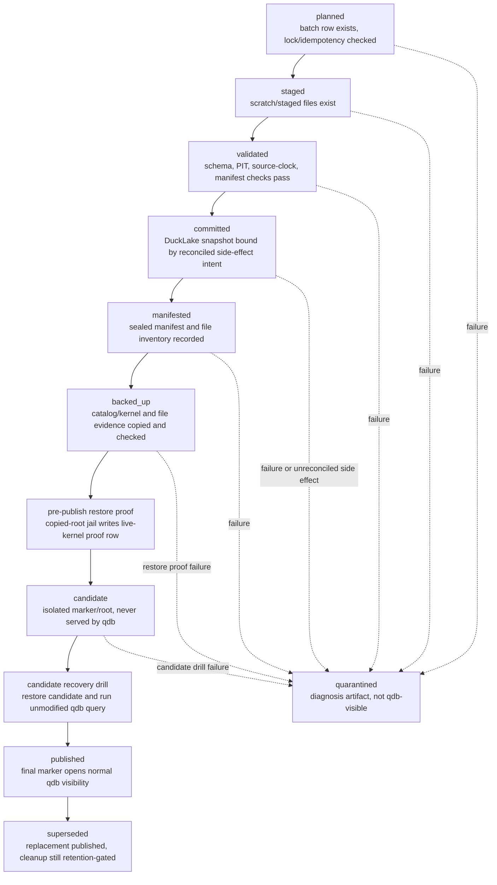

# CCC DuckLake v7.2.3 Publish Control Kernel

Every postponed DuckLake, maintenance, hardening, or runtime-constant item in this module follows DD-002, DD-017, DD-020, and DD-024 in [[PRJ-AI-CCC-DuckLake-v7.2.3-Deferred-Decision-Registry]]. The kernel never treats an unresolved registry item as permission to seal, publish, delete, or widen authority.

This module is the v7.2.3 structural port of the v6.5.0 publish/control kernel. It preserves the approved phase order, refusal behavior, state machine, DDL seed, lock protocol, idempotency protocol, side-effect reconciliation protocol, migration concurrency rules, owner-local tests, and recovery valid-state definitions without turning Dagu, Ops, Manifests, or `qdb` into the system of record.

## Owns

- Kernel state, records, DDL seed, transaction protocol, legal transitions, state-validation requirements, transition preconditions, recovery valid states, and publish visibility invariants.
- Dataset registry, batch state, lock, source batch, validation artifact, publish manifest metadata row, backup marker, restore proof, cleanup eligibility, and side-effect intent records as kernel-owned system-of-record tables.
- Lock lease, heartbeat, advisory-lock hierarchy, serialization retry, idempotency uniqueness, side-effect commit/reconcile protocol, backup marker ordering, and migration concurrency.
- Requirement authority for `REQ-WRITE-*`, `REQ-KERNEL-*`, `REQ-KERNEL-TXN`, `REQ-KERNEL-RETRY`, and `REQ-KERNEL-SM`.

## Depends On

- [[260708-DuckLake-Quant-Stack-PRD-v7.2.3]] for root version routing and source-set control.
- [[PRJ-AI-CCC-DuckLake-v7.2.3-Manifests-Lineage-And-Fixtures]] for sealed manifest payload, canonical JSON hashing, file-inventory payload shape, restore-bundle inventory shape, and fixture inputs.
- [[PRJ-AI-CCC-DuckLake-v7.2.3-PIT-And-Bitemporal-Policy]] for PIT clock semantics and bitemporal correction policy.
- [[PRJ-AI-CCC-DuckLake-v7.2.3-Dataset-Contracts-And-Validation]] for canonical dataset schemas and contract validation.
- [[PRJ-AI-CCC-DuckLake-v7.2.3-Orchestration-And-QDBCTL]] for CLI, Dagu, trigger, and command procedure ownership.
- [[PRJ-AI-CCC-DuckLake-v7.2.3-Ops-Recovery-Maintenance-Security]] for restore, backup, cleanup, maintenance, and operator runbook procedures.
- [[PRJ-AI-CCC-DuckLake-v7.2.3-QDB-Agent-Access-And-SQL-Zero]] for API-level visibility enforcement and API-specific refusal errors.

## Read After

- [[PRJ-AI-CCC-DuckLake-v7.2.3-Executive-Contract-And-Authority]]
- [[PRJ-AI-CCC-DuckLake-v7.2.3-Architecture-Context-And-Bootstrap]]

## Non-Authoritative Restatements

- Ops owns restore, backup, cleanup, maintenance, and runbook procedures; this module owns only the kernel state rows, state transitions, and proof-gate invariants those procedures must satisfy.
- Orchestration owns Dagu and `qdbctl` trigger surfaces; this module owns what those commands must prove before kernel state can advance.
- Manifests owns immutable manifest payload/file inventory rules; this module owns the kernel row that binds a sealed manifest to a batch and controls visibility.
- PIT owns financial knowledge-time semantics; this module owns the commit-time mechanics that must preserve those semantics without fact blackout.

## Source Port

| Source | Ported content |
|---|---|
| Primary PRD 575-979 | Kernel state, minimum records, DDL seed, transaction protocol, legal transitions, flowchart, serialization retry, backup marker ordering, side-effect commit protocol, bitemporal commit mechanics, migration concurrency, kernel rules, lock lease, heartbeat, and advisory-lock hierarchy. |
| Primary PRD 1017-1179 | State portions only: backup completion state, restore proof state, candidate state, copied-root proof flags, file-inventory linkage, and maintenance wrapper references where they constrain kernel state. Ops retains procedure ownership. |
| Primary PRD 1508-1515 | DuckLake and PostgreSQL catalog requirements preserved as `REQ-LAKE-*`. |
| Primary PRD 1517-1535 | `REQ-WRITE` and `REQ-KERNEL` requirement bullets. |
| Primary PRD 3483-3507 and 3525-3607 | Owner-local kernel, state, lock, idempotency, side-effect, migration, backup marker, and manifest contract tests that directly verify kernel behavior. |

Table: v6.5.0 source ranges structurally ported into this module.

## Publish/Control Kernel

The kernel is the publish ledger, data-contract registry, recovery authority, and visibility gate. Dagu runs and DuckLake commits are not enough to define what is safe for research. Dagu calls deterministic CLI commands that update the kernel; Dagu is never the system of record and must not encode kernel logic in YAML.

## Kernel State It Owns

| Element | Purpose |
|---|---|
| Dataset registry | Declares each canonical dataset, its contract, and its current published version. |
| Batch state machine | `planned -> staged -> validated -> committed -> manifested -> backed_up -> candidate -> published`, plus `quarantined` and `superseded`. The `candidate` stage is an isolated pre-publish promotion that normal `qdb` consumers never see; only a passed candidate recovery drill promotes the final `published` marker. |
| Lock / idempotency key | Per dataset/partition; serializes publish and prevents duplicate or concurrent writes. |
| Contract binding | Dataset-contract version and source hashes tied to the batch. |
| Staging paths | Where Polars/PyArrow wrote staged artifacts for validation. |
| DuckLake snapshot binding | The committed snapshot ID a published batch corresponds to. |
| Lake-root binding | The canonical data root URI the snapshot's files live under. |
| Manifest hash | Hash of the durable publish manifest. |
| Validation artifact hash | Hash of the persisted validation report. |
| Backup binding | Backup ID/checksum tying the published batch to a catalog backup. |
| Cleanup eligibility | Whether a file/snapshot may be cleaned, respecting backup-retention windows. |
| Visibility / published state | The only state `qdb` reads from; unvalidated or failed batches are never visible. |

Table: State the publish/control kernel owns as the system of record.

## Minimum Kernel Record Detail

The kernel can start small, but it cannot be vague. Before broad adapters, the repo needs concrete records that bind state, files, validation, snapshots, backup evidence, restore proof, cleanup eligibility, and visibility.

| Record | Must bind |
|---|---|
| Dataset registry | Dataset name, version, contract version, owner, PIT mode, allowed APIs, storage namespace, visibility status, caveats, and active manifest ID. |
| Batch state | Batch ID, dataset, partition/scope, idempotency key, writer identity, state, attempts, timestamps, failure reason, and quarantine path. |
| Lock | Dataset/partition lock key, holder, lease/heartbeat, acquired/released timestamps, and conflict behavior. |
| Source batch | Provider, source dataset, source version, raw paths, SHA-256 hashes, source time range, source availability range, row/file counts, and adapter version. |
| Validation artifact | Contract version, validation status, check summaries, strictness mode, source-overlap tolerances, report path, and report hash. |
| Publish manifest | Manifest ID, batch ID, source batch IDs, validation artifact ID, DuckLake snapshot ID, output tables/files, lake root ID, code version, environment lock, contract version, row counts, time ranges, PIT policies, and caveats. |
| Backup marker | Backup ID, manifest ID, catalog identity, snapshot ID, lake root ID, backup path, checksum, global-object coverage, backup status, candidate marker/root, and restore evidence path. |
| Restore proof | Restore ID, batch ID, backup ID, manifest ID, target root and catalog-DSN fingerprint, restore-bundle inventory hash, proof mode, proof status, live-root-denied and live-path-leak flags, and timestamps. |
| Cleanup eligibility | File/snapshot, manifest references, backup references, retention window, dry-run status, delete eligibility, and approval evidence. |

Table: Minimum field-level kernel detail before broad source adapters.

## Kernel DDL Seed

The kernel records plus the side-effect intent ledger become these PostgreSQL 16 tables. This remains migration-ready for `src/qdb_kernel/migrations/0001_kernel.sql` and `qdbctl migrate`. State uses `text` plus `CHECK` because the legal-transition graph is richer than enum membership and is enforced in `src/qdb_kernel/transitions.py`; idempotency is a single `UNIQUE (dataset, partition_scope, idempotency_key)` constraint on `batch_state`.

```sql
-- Kernel schema, PostgreSQL 16. One database holds this AND the DuckLake
-- catalog (REQ-RESTORE-CATALOG-UNITY). Apply as migration 0001 via `qdbctl migrate`.
--
-- Transaction policy (REQ-KERNEL-TXN, REQ-WRITE-SERIAL):
--   * Every canonical publish transition runs in ONE transaction at
--     ISOLATION LEVEL SERIALIZABLE set by the CLI via SET TRANSACTION, so a concurrent publisher
--     cannot interleave a half-applied transition.
--   * Serialization failures retry up to 3x with short jittered backoff, but
--     ONLY when the transaction rolled back before any external side effect
--     (DuckLake commit, manifest seal, backup file, restore copy, cleanup
--     delete); after a side effect, recover via idempotency/diagnose, never
--     blind retry (REQ-KERNEL-RETRY). Each retry emits a kernel_transition_event.
--   * Metadata mutual exclusion across processes is pg_advisory_xact_lock(advisory_key)
--     taken at the top of each transition transaction; it auto-releases on
--     commit/abort or connection loss. Long-running publish ownership is enforced
--     by the durable `lock` lease row: transition guards and publish-path children
--     verify the active holder and unexpired lease before state progression or
--     local/canonical side effects (see Lock Lease And Heartbeat).
--   * Legal transitions are enforced in src/qdb_kernel/transitions.py, NOT in
--     triggers. The authoritative map:
--       planned      -> staged
--       staged       -> validated
--       validated    -> committed
--       committed    -> manifested
--       manifested   -> backed_up
--       backed_up    -> candidate
--       candidate    -> published
--       <any active> -> quarantined
--       published    -> superseded
--     The CHECK below only constrains the VALUE domain; the guard constrains
--     the EDGES.

CREATE TABLE dataset_registry (
    dataset             text PRIMARY KEY,
    registry_version    bigint      NOT NULL DEFAULT 1,
    contract_version    bigint      NOT NULL,
    owner               text        NOT NULL,
    pit_mode            text        NOT NULL
                          CHECK (pit_mode IN ('required','reference','not_applicable')),
    allowed_apis        text[]      NOT NULL DEFAULT '{}',
    storage_namespace   text        NOT NULL,
    visibility_status   text        NOT NULL DEFAULT 'fixture_only'
                          CHECK (visibility_status IN ('active','disabled','fixture_only')),
    active_manifest_id  text,
    caveats             jsonb,
    created_at          timestamptz NOT NULL DEFAULT now(),
    updated_at          timestamptz NOT NULL DEFAULT now()
);

CREATE TABLE batch_state (
    batch_id            text PRIMARY KEY,
    dataset             text        NOT NULL REFERENCES dataset_registry(dataset),
    partition_scope     text        NOT NULL,
    idempotency_key     text        NOT NULL,
    writer_identity     text        NOT NULL,
    state               text        NOT NULL DEFAULT 'planned'
                          CHECK (state IN ('planned','staged','validated','committed',
                                           'manifested','backed_up','candidate','published',
                                           'quarantined','superseded')),
    attempts            bigint      NOT NULL DEFAULT 0,
    contract_version    bigint      NOT NULL,
    staging_path        text,
    failure_reason      text,
    quarantine_path     text,
    created_at          timestamptz NOT NULL DEFAULT now(),
    updated_at          timestamptz NOT NULL DEFAULT now(),
    UNIQUE (dataset, partition_scope, idempotency_key)
);

CREATE TABLE lock (
    dataset             text        NOT NULL REFERENCES dataset_registry(dataset),
    partition_scope     text        NOT NULL,
    advisory_key        bigint      NOT NULL,
    holder              text,
    lease_expires_at    timestamptz,
    heartbeat_at        timestamptz,
    acquired_at         timestamptz,
    released_at         timestamptz,
    PRIMARY KEY (dataset, partition_scope)
);

CREATE TABLE source_batch (
    source_batch_id       text PRIMARY KEY,
    batch_id              text        NOT NULL REFERENCES batch_state(batch_id),
    provider              text        NOT NULL,
    source_dataset        text        NOT NULL,
    source_version        text        NOT NULL,
    source_availability_policy_ids text[] NOT NULL,
    adapter_version       text        NOT NULL,
    raw_paths             text[]      NOT NULL,
    input_sha256          jsonb       NOT NULL,
    source_time_min       timestamptz,
    source_time_max       timestamptz,
    source_available_min  timestamptz,
    source_available_max  timestamptz,
    row_count             bigint,
    file_count            bigint,
    ingested_at           timestamptz NOT NULL,
    created_at            timestamptz NOT NULL DEFAULT now()
);

CREATE TABLE validation_artifact (
    validation_artifact_id  text PRIMARY KEY,
    batch_id                text        NOT NULL REFERENCES batch_state(batch_id),
    contract_version        bigint      NOT NULL,
    status                  text        NOT NULL
                              CHECK (status IN ('passed','failed','passed_with_warnings')),
    strictness_mode         text        NOT NULL,
    check_summaries         jsonb       NOT NULL,
    source_overlap_tolerances jsonb,
    report_path             text        NOT NULL,
    report_sha256           text        NOT NULL,
    created_at              timestamptz NOT NULL DEFAULT now()
);

CREATE TABLE publish_manifest (
    manifest_id             text PRIMARY KEY,
    batch_id                text        NOT NULL REFERENCES batch_state(batch_id),
    source_batch_ids        text[]      NOT NULL,
    validation_artifact_id  text        NOT NULL REFERENCES validation_artifact(validation_artifact_id),
    ducklake_snapshot_id    text        NOT NULL,
    lake_root_id            text        NOT NULL,
    output_tables           text[]      NOT NULL,
    file_inventory          jsonb       NOT NULL,
    file_inventory_mode     text        NOT NULL DEFAULT 'files'
                              CHECK (file_inventory_mode IN ('files','inlined','mixed')),
    inlined_row_count       bigint      NOT NULL DEFAULT 0,
    code_version            text        NOT NULL,
    environment_lock        text        NOT NULL,
    contract_version        bigint      NOT NULL,
    row_count               bigint      NOT NULL,
    valid_time_min          timestamptz,
    valid_time_max          timestamptz,
    source_available_min    timestamptz,
    source_available_max    timestamptz,
    pit_policy              text        NOT NULL,
    adjustment_policy       text,
    caveats                 jsonb,
    manifest_sha256         text        NOT NULL,
    created_at              timestamptz NOT NULL DEFAULT now()
);

CREATE TABLE backup_marker (
    backup_id               text PRIMARY KEY,
    manifest_id             text        NOT NULL REFERENCES publish_manifest(manifest_id),
    catalog_identity        text        NOT NULL,
    ducklake_snapshot_id    text        NOT NULL,
    lake_root_id            text        NOT NULL,
    backup_path             text        NOT NULL,
    backup_sha256           text        NOT NULL,
    restic_repo_id              text,
    restic_snapshot_id          text,
    pg_dump_sha256              text,
    pg_dumpall_globals_sha256   text,
    globals_coverage        text        NOT NULL,
    restore_mode            text        NOT NULL DEFAULT 'copied_root_scratch'
                              CHECK (restore_mode IN ('copied_root_scratch','same_root_smoke')),
    backup_status           text        NOT NULL DEFAULT 'started'
                              CHECK (backup_status IN ('started','completed')),
    backup_started_at       timestamptz NOT NULL DEFAULT now(),
    backup_completed_at     timestamptz,
    candidate_root_path     text,
    candidate_marker        text,
    restore_evidence_path   text,
    created_at              timestamptz NOT NULL DEFAULT now(),
    CHECK ((backup_status = 'completed') = (backup_completed_at IS NOT NULL))
);

CREATE TABLE restore_proof (
    restore_id              text PRIMARY KEY,
    batch_id                text        NOT NULL REFERENCES batch_state(batch_id),
    backup_id               text        NOT NULL REFERENCES backup_marker(backup_id),
    manifest_id             text        NOT NULL REFERENCES publish_manifest(manifest_id),
    target_root_id          text        NOT NULL,
    target_dsn_fingerprint  text        NOT NULL,
    inventory_hash          text        NOT NULL,
    proof_mode              text        NOT NULL
                              CHECK (proof_mode IN ('pre_publish_restorability','candidate_recovery_drill')),
    proof_status            text        NOT NULL DEFAULT 'started'
                              CHECK (proof_status IN ('started','passed','failed')),
    live_root_denied        boolean     NOT NULL,
    live_path_leak_detected boolean     NOT NULL DEFAULT false,
    created_at              timestamptz NOT NULL DEFAULT now(),
    completed_at            timestamptz,
    CHECK ((proof_status IN ('passed','failed')) = (completed_at IS NOT NULL)),
    CHECK (proof_status <> 'passed' OR (live_root_denied AND NOT live_path_leak_detected))
);

CREATE TABLE cleanup_eligibility (
    cleanup_id              text PRIMARY KEY,
    file_or_snapshot_key    text        NOT NULL,
    manifest_ids            text[]      NOT NULL,
    backup_ids              text[]      NOT NULL,
    cleanup_protected_until timestamptz NOT NULL,
    dry_run_status          text        NOT NULL DEFAULT 'not_run'
                              CHECK (dry_run_status IN ('not_run','dry_run_passed','dry_run_failed')),
    delete_eligible         boolean     NOT NULL DEFAULT false,
    approval_hash           text,
    created_at              timestamptz NOT NULL DEFAULT now(),
    updated_at              timestamptz NOT NULL DEFAULT now()
);

CREATE TABLE side_effect_intent (
    effect_scope_id         text        NOT NULL,
    batch_id                text        REFERENCES batch_state(batch_id),
    cleanup_id              text        REFERENCES cleanup_eligibility(cleanup_id),
    effect_type             text        NOT NULL
                              CHECK (effect_type IN ('ducklake_commit','manifest_seal','catalog_backup','copied_root_restore','cleanup_delete')),
    idempotency_key         text        NOT NULL,
    status                  text        NOT NULL DEFAULT 'started'
                              CHECK (status IN ('started','completed','abandoned')),
    effect_fingerprint      text        NOT NULL,
    effect_result_json      jsonb,
    created_at              timestamptz NOT NULL DEFAULT now(),
    completed_at            timestamptz,
    PRIMARY KEY (effect_type, effect_scope_id),
    UNIQUE (effect_type, effect_fingerprint),
    CHECK ((status = 'completed') = (completed_at IS NOT NULL)),
    CHECK (
      (effect_type = 'cleanup_delete'
       AND cleanup_id IS NOT NULL
       AND cleanup_id = effect_scope_id
       AND batch_id IS NULL)
      OR
      (effect_type <> 'cleanup_delete'
       AND batch_id IS NOT NULL
       AND batch_id = effect_scope_id
       AND cleanup_id IS NULL)
    )
);

-- v7.2.3: bounded auto-retry scheduling for transient side-effect failures
-- (REQ-KERNEL-OUTBOX-01/02). Companion to side_effect_intent, never a replacement.
CREATE TABLE side_effect_retry_state (
    effect_type             text        NOT NULL,
    effect_scope_id         text        NOT NULL,
    attempt_count           int         NOT NULL DEFAULT 0,
    next_retry_at           timestamptz,
    retry_after_class       text        NOT NULL DEFAULT 'immediate'
                              CHECK (retry_after_class IN ('immediate','1min','5min','30min')),
    max_attempts            int         NOT NULL DEFAULT 3,
    terminal_reason         text,
    created_at              timestamptz NOT NULL DEFAULT now(),
    updated_at              timestamptz NOT NULL DEFAULT now(),
    PRIMARY KEY (effect_type, effect_scope_id),
    FOREIGN KEY (effect_type, effect_scope_id)
      REFERENCES side_effect_intent (effect_type, effect_scope_id)
);

ALTER TABLE dataset_registry
    ADD CONSTRAINT dataset_registry_active_manifest_fk
    FOREIGN KEY (active_manifest_id) REFERENCES publish_manifest(manifest_id);

-- delete_eligible is a computed guard, never a manual flag (REQ-KERNEL, CR-014).
-- Only the cleanup-eligibility computing function may raise it true. A trigger
-- rejects any statement that flips delete_eligible to true unless the session
-- carries the computing function's marker (set_config('qdb.cleanup_compute','on')),
-- so a direct UPDATE that hand-sets delete_eligible=true is refused. Sites that
-- cannot rely on the trigger MUST instead REVOKE UPDATE (delete_eligible) from all
-- roles except the owner of the computing function.
CREATE FUNCTION cleanup_eligibility_guard_delete_eligible()
RETURNS trigger AS $$
BEGIN
    IF NEW.delete_eligible AND NOT COALESCE(OLD.delete_eligible, false)
       AND current_setting('qdb.cleanup_compute', true) IS DISTINCT FROM 'on' THEN
        RAISE EXCEPTION
          'delete_eligible is a computed guard; only the cleanup-eligibility computing function may set it';
    END IF;
    RETURN NEW;
END;
$$ LANGUAGE plpgsql;

CREATE TRIGGER cleanup_eligibility_delete_eligible_guard
    BEFORE INSERT OR UPDATE ON cleanup_eligibility
    FOR EACH ROW EXECUTE FUNCTION cleanup_eligibility_guard_delete_eligible();
```

Listing: Phase 0 kernel DDL (`REQ-KERNEL-TXN`, `REQ-WRITE-SERIAL`). State value is constrained by `CHECK`; legal edges are enforced by the CLI guard, idempotency is enforced by the unique constraint plus the read-existing plan retry path, and `delete_eligible` is a computed guard, never a manual flag — the `cleanup_eligibility_delete_eligible_guard` trigger (or an equivalent `REVOKE UPDATE (delete_eligible)`) makes "computed guard, never a manual flag" enforced rather than aspirational, so only the computing function can raise it. Backed by `test_delete_eligible_cannot_be_set_by_direct_update`. Staging paths are kernel state with a DDL home (FBL2-18): `batch_state.staging_path` is written at `planned -> staged`, so a fresh process can re-locate staged files for a CX1 retry without out-of-band knowledge. Kernel-DDL to manifest-seed field-name map (FBL2-24): `source_batch.input_sha256` maps to the manifest's `source_batches[].input_hashes`, and `validation_artifact.report_sha256` maps to the manifest's `validation.report_hash` — same values, different names; `test_publish_manifest_contract_matches_kernel_ddl_and_manifest_seed` and `test_source_batch_contract_matches_kernel_ddl_structured_paths_and_hashes` compare through this map.

## Kernel Transaction Protocol

The Phase 0 kernel must ship with executable DDL, legal transitions, transition preconditions, idempotency uniqueness, lock scopes, crash-recovery points, and backup/publish ordering. A publish is not complete until staging, validation, DuckLake commit, manifest plus file inventory, a completed catalog-and-kernel backup, a passed pre-publish restorability proof and a passed candidate recovery drill, and the final published marker promoted from the candidate are bound to the same batch. Direct `planned -> published`, `staged -> published`, `validated -> published`, `committed -> published`, and `backed_up -> published` transitions are illegal.

| Transition | Required preconditions | Visibility |
|---|---|---|
| `planned -> staged` | Dataset registered, idempotency key unique, lock acquired, scratch/staging path allocated. | Not visible |
| `staged -> validated` | Staged files exist, schema/materialized checks complete, validation artifact hash recorded. | Not visible |
| `validated -> committed` | SQL/PIT/source-clock checks pass and canonical write lock is held. | Not visible |
| `committed -> manifested` | DuckLake snapshot ID, lake root ID, and snapshot file inventory recorded. | Not visible |
| `manifested -> backed_up` | Manifest validates; the catalog-and-kernel backup copy, checksum, and restore-bundle inventory all verify so `backup_marker.backup_status = completed`; globals coverage recorded. | Not visible |
| `backed_up -> candidate` | The pre-publish restorability proof passed in scoped proof-mode under the copied-root jail, a durable `restore_proof` row exists with `proof_status = passed`, and the batch is promoted to an isolated candidate marker/root. | Not visible; candidate is never served by `qdb`. |
| `candidate -> published` | The candidate recovery drill restored the candidate catalog and ran an unmodified `qdb` query against the candidate, never the live root, and passed; the final published marker is promoted once. | Visible to `qdb` |
| any active state -> `quarantined` | Validation, commit, manifest, backup, restore-proof, or candidate-drill failure, or a redaction failure, with a diagnosis artifact; a quarantined candidate is never promoted. | Not visible |
| `published -> superseded` | Replacement published batch exists and the old manifest stays cleanup-protected through retention. | Historical visibility only |

Table: Minimal legal Phase 0 kernel transitions (`REQ-KERNEL-TXN`).

Quarantine is terminal per batch row (FBL2-04): the map above deliberately defines no `quarantined ->` edge. Operator retry after diagnosis is `qdbctl plan` with a NEW idempotency key — the quarantined row is never rewound and is preserved as evidence; re-running `plan` with the SAME key returns the quarantined batch identity per the read-existing rule and refuses to progress it. Before committing, the new batch MUST reconcile any COMPLETED side-effect intent recorded for the same `(dataset, partition_scope)` scope by the quarantined attempt, discovered and reconciled through the CX1 recovery rules, never re-driven blind. Backed by `test_quarantined_batch_retry_requires_new_idempotency_key_and_reconciles_completed_intents`.

For the `<any active> -> quarantined` edge, active = {`planned`, `staged`, `validated`, `committed`, `manifested`, `backed_up`, `candidate`} (FBL2-19). `published` and `superseded` are never quarantined: a post-publish redaction or integrity finding raises an operator diagnosis (and, where warranted, supersession by a corrected batch), never a state rewind.

Three removal-adjacent words stay distinct across the kernel and Ops (v7.1.1): **quarantine** is the kernel batch state above (or the `not_publishable` diagnostic marking for parsed-without-raw evidence) — data set aside as evidence, never promoted; **archive** is the reversible Ops file action under `REQ-MAINT-05` in [[PRJ-AI-CCC-DuckLake-v7.2.3-Ops-Recovery-Maintenance-Security]] — a move/copy with metadata and restore instructions that never mutates kernel state and never touches raw/bronze/silver evidence, manifests, or provider capability evidence; **physical deletion** is the only irreversible action and stays behind `cleanup_eligibility`'s computed `delete_eligible` guard, the dry-run artifact, the approval hash, and Ryan's approval (`REQ-MAINT-02`). Archiving an artifact never makes it `delete_eligible`; the two lifecycles are independent.

| Crash boundary | Safe restart action (FBL2-19) |
|---|---|
| `plan`/`stage` (pre-side-effect) | Re-run the transition; serialization retry and the read-existing idempotency rule apply. |
| `validate` | Re-run validation; the validation artifact hash is re-recorded. |
| `commit` (DuckLake side effect) | CX1 intent/reconcile; never blind retry. |
| `manifest` seal | CX1 intent/reconcile for `manifest_seal`. |
| `backup` (CX3) | The `started` marker stays; re-run backup; only `completed` advances state. |
| restore proof | A `restore_proof` row stuck at `proof_status = 'started'` is abandoned in place and a NEW `restore_id` is minted for the re-run; stale `started` rows are never updated to `passed`/`failed`. |
| candidate promotion / publish transaction | A passed drill without a promoted marker re-runs ONLY the promotion transaction; the finalizer re-checks the lease per CX6. |
| intent abandonment | `side_effect_intent.status = 'abandoned'` is set only by the diagnose/quarantine handling path, never by transition code. |

Table: Named crash-recovery actions per boundary (`REQ-KERNEL-TXN`, FBL2-19).



Figure: Publish/control kernel lifecycle. Normal `qdb` visibility opens only at `published`; proof-gate nodes are shown as flowchart steps, not kernel states; any failed validation, side-effect reconciliation, backup, restore proof, or candidate drill sends the batch to `quarantined` with a diagnosis artifact.

## Serialization Retry

Kernel state-transition transactions retry PostgreSQL serialization failures up to three times with short jittered backoff, but only when the transaction rolled back before any external side effect: DuckLake commit, manifest seal, catalog-backup file creation, copied-root restore copy, or cleanup deletion. After any external side effect, recovery never blind-retries; it proceeds through idempotency, state inspection, quarantine, or `qdbctl diagnose`. The serialization-retry decorator MUST never wrap a transition that has already produced a side effect, so a serialization failure raised after the DuckLake commit does not re-drive the commit. Every retry attempt emits a `kernel_transition_event`, and the serialization-failure rate plus retry/backoff constants remain verification items under real concurrent load. Backed by `test_serialization_failure_after_ducklake_commit_does_not_retry_commit`.

## Backup Marker Ordering (CX3)

The `manifested -> backed_up` transition writes backup evidence in the only order that avoids self-hashing paradoxes and false restore proof: create the catalog dump and globals dump, hash those dump files, insert the `backup_marker` row into the live catalog+kernel database with `backup_status = 'started'`, then back up or copy the dump and lake/artifact roots. The marker flips to `backup_status = 'completed'` only after every dump and file copy finishes and its checksum and restore-bundle inventory verify; `manifested -> backed_up` is reached only at `backup_status = 'completed'`. A crash after the `started` marker but before completion leaves `backup_status = 'started'`, which is never `backed_up` and never publishable. Because the catalog dump is created and hashed before the `started` marker is inserted, the dump's BYTE CONTENT must exclude the `started` backup-marker row itself, not merely null-order or column-null that row: the dump file that gets hashed and copied must contain no trace of the marker whose creation it precedes, so a restore of that dump cannot reintroduce a half-written marker. Backed by `test_backup_marker_written_after_dump_hash`, `test_crash_after_backup_marker_before_file_copy_does_not_mark_backed_up_or_publish`, and `test_catalog_dump_excludes_started_backup_marker_row`.

## Restore Proof And Candidate Drill Evidence (CX7)

`restore_proof.live_root_denied` has no `DEFAULT`; drill code MUST set it explicitly, and its absence means not proven rather than proven, while the `proof_status = 'passed'` CHECK still requires `live_root_denied AND NOT live_path_leak_detected`. The candidate recovery drill must prove its answer came from the restored root, not the live one: the drill fixture plants a sentinel row that is present in the restored catalog and ABSENT at the live root, and the drill answer must equal the restored value, so a drill that silently read the live root diverges from the sentinel and fails. Backed by `test_candidate_drill_answers_from_restored_root_proven_by_sentinel_divergence`.

## Candidate And Publish Physical Definition (FBL2-05)

The candidate stage and the "final published marker" are physical, not metaphorical. Candidate = `batch_state.state = 'candidate'` PLUS `backup_marker.candidate_marker = <manifest_id>` PLUS `backup_marker.candidate_root_path` = a fresh root RESERVED for the restored copy of that batch's `backup_id`. Promotion itself is a pure kernel mutation (`idempotent_mutation_pre_side_effect` per `REQ-DAGU-02`): it records the marker and allocates the empty fresh root. The candidate recovery drill — the restore node that follows — is what materializes that root, restoring the batch's own `backup_id` into `candidate_root_path` and querying it there, never the live scratch root. Publish = ONE `SERIALIZABLE` transaction that both sets `state = 'published'` AND updates `dataset_registry.active_manifest_id = <manifest_id>`; the "final published marker" is exactly that registry-pointer flip. `qdb` visibility (`REQ-KERNEL-03`) is a registry-pointer join through `dataset_registry.active_manifest_id`, never a scan for `state = 'published'` rows, so a half-promoted batch can never leak into `qdb` through a state scan.

## External Side-Effect Commit Protocol (CX1)

The `validated -> committed` transition includes a DuckLake commit, an external side effect. Unless `docs/runtime-verification/ducklake_kernel_atomicity.json` proves the DuckLake commit and the kernel state update occur in the same PostgreSQL transaction, every external side effect uses an intent/reconcile protocol so a crash between the side effect and the kernel write never double-commits, never strands an unmanifested snapshot, and never silently re-commits.

For `validated -> committed`:

1. In a `SERIALIZABLE` kernel transaction, acquire the advisory lock, verify `state = validated`, compute `commit_fingerprint = sha256(canonical_json({batch_id,dataset,partition_scope,idempotency_key,contract_version,staged_input_hashes,planned_tables}))`, insert or update `side_effect_intent(effect_scope_id=batch_id, batch_id, cleanup_id=NULL, effect_type='ducklake_commit', idempotency_key, status='started', effect_fingerprint)`, then commit. The two non-column fingerprint inputs have a pinned canonical derivation: `staged_input_hashes` is the lexicographically sorted list of per-file SHA-256 digests of the batch's staged Parquet files (each digest in the lowercase-hex `sha256:`-prefixed form required by the schema convention in [[PRJ-AI-CCC-DuckLake-v7.2.3-Manifests-Lineage-And-Fixtures]], `^sha256:[a-f0-9]{64}$` — never bare hex; FBL2-18), and `planned_tables` is the lexicographically sorted list of fully-qualified target table names; both are serialized through the canonical-JSON authority in [[PRJ-AI-CCC-DuckLake-v7.2.3-Manifests-Lineage-And-Fixtures]] before hashing, so the fingerprint is stable across processes and call sites. The committed stability test (`test_commit_fingerprint_payload_is_canonical_json_and_stable`) includes a `staged_input_hashes` entry in its vector so a bare-hex versus `sha256:`-prefixed divergence fails the vector rather than silently forking the fingerprint (FBL2-18).
2. Perform exactly one DuckLake commit for that deterministic `commit_fingerprint`. The preferred probe is commit metadata containing `batch_id` and `commit_fingerprint`; if that cannot be proven, row-carried fingerprints or a returned snapshot ID may be used only under the runtime-proof restrictions in `docs/runtime-verification/ducklake_commit_fingerprint_discovery.json`.
3. In a new `SERIALIZABLE` kernel transaction, reacquire the advisory lock, discover the committed DuckLake snapshot by `commit_fingerprint`, set the side-effect intent to `completed`, persist `ducklake_snapshot_id` (into `side_effect_intent.effect_result_json`), and transition `batch_state` to `committed`.

The discovery artifact carries `reconciliation_status: proven | quarantine_fallback` and `discovery_route: commit_extra_info | row_carried_fingerprint | returned_snapshot_id | null`. Only `reconciliation_status = proven` with a non-null real `discovery_route` satisfies discovery-proven gates. If none is verified, the artifact records `reconciliation_status = quarantine_fallback`, the batch quarantines instead of attempting crash reconciliation, and Phase 0 fixture-core is green only when `test_ducklake_commit_quarantine_fallback_blocks_prelive_promotion` proves no second commit, no `published` visibility, a durable diagnosis artifact, and a blocked operator-required retry.

`reconciliation_status = quarantine_fallback` is valid ONLY when the probe artifact records all THREE named discovery routes (`commit_extra_info`, `row_carried_fingerprint`, `returned_snapshot_id`) as attempted and failed, each with an `observed_output_hash` transcript entry. A defaulted or hard-coded `quarantine_fallback` that skips the probe is a gate failure, not a valid fallback. `null` is the fallback sentinel written after all real routes fail, never itself an attemptable route. Backed by `test_discovery_route_probe_transcript_shows_all_routes_attempted`, `test_discovery_route_matches_observed_commit_metadata_field`, and `test_prelive_requires_at_least_one_proven_publish_end_to_end` (xfail until wired; blocking at any pre-live claim).

Recovery rules:

- No intent and no side effect: retry is allowed.
- Intent `started` and no discoverable snapshot: retry the side effect only if its command is idempotent for `commit_fingerprint`; otherwise quarantine.
- Discoverable snapshot and state still `validated`: reconcile to `committed`; do not commit again.
- Discoverable snapshot but validation later failed or quarantined: the snapshot stays invisible and the batch is quarantined with diagnosis.
- After any side effect, `qdbctl diagnose` is the operator path; blind transition retry is forbidden.

The same intent/reconcile pattern applies to the manifest seal, catalog-backup file creation, copied-root restore copy, and cleanup deletion. Batch-bound side effects use `effect_scope_id = batch_id`; cleanup deletion uses `effect_scope_id = cleanup_id`, leaves `batch_id` null, and uses a deterministic cleanup-delete `idempotency_key`: `cleanup_eligibility.approval_hash` when present, otherwise `cleanup_id`. The table refuses a second row for the same `(effect_type, effect_scope_id)` even if a retry proposes a different `idempotency_key` or `effect_fingerprint`. An intent retry that proposes a different `effect_fingerprint` for the same scope must reconcile gracefully rather than crash: the `ON CONFLICT` clause targets the `(effect_type, effect_scope_id)` primary-key constraint, not the `(effect_type, effect_fingerprint)` unique constraint, so the existing intent is observed and reconciled instead of raising an unhandled violation. Backed by `test_intent_retry_with_different_fingerprint_same_scope_reconciles_gracefully_not_crash`, `test_ducklake_commit_discovery_proven_reconciles_not_double_commits`, `test_ducklake_commit_quarantine_fallback_blocks_prelive_promotion`, `test_cleanup_delete_intent_is_keyed_by_cleanup_id_not_dummy_batch_id`, `test_side_effect_intent_non_cleanup_requires_batch_id`, `test_side_effect_intent_cleanup_requires_cleanup_id`, `test_side_effect_intent_null_scope_cannot_pass_unknown_check`, `test_cleanup_delete_retry_reuses_deterministic_idempotency_key`, `test_ducklake_commit_fingerprint_discovery_proves_reconciliation_surface`, `test_side_effect_intent_route3_persists_returned_snapshot_id`, and a fault-injection fixture that crashes between the external side effect and kernel completion.

## Bitemporal Supersession On Commit (`CX4`)

When a batch carries vendor corrections or amendments for logical keys already present, the `commit` step must, in the same DuckLake transaction that writes the new rows, first close the superseded rows and then insert the new ones. The close timestamp is row-level, not batch-level: each superseded logical key closes at the replacement row's own `source_available_at` or derived `known_from` value, so a mixed-availability correction batch cannot make one fact disappear too early or remain visible too long. This module owns the transactional close/insert requirement; [[PRJ-AI-CCC-DuckLake-v7.2.3-PIT-And-Bitemporal-Policy]] owns the clock semantics. Backed by `test_bitemporal_supersession_rollback_prevents_fact_blackout` and `test_bitemporal_supersession_uses_replacement_row_source_available_at`.

## Migration Engine Concurrency (`AW2`)

The raw-SQL migrator creates the tracking table before it ever tries to lock it: the first-run path executes `CREATE TABLE IF NOT EXISTS schema_migrations (version text primary key, applied_at timestamptz not null default now())` outside or at the very start of the migration transaction, then each `.sql` file runs inside `BEGIN ... COMMIT` and takes an explicit table lock on `schema_migrations` before checking or inserting that migration's version row. This ordering lets the first run serialize instead of failing on a missing lock target, and two concurrent migrators serialize instead of double-applying or racing the version row. Backed by `test_concurrent_migrators_serialize`, `test_schema_migrations_table_exists_before_first_lock`, and the first-run path in `test_kernel_migrations_create_phase0_tables_with_constraints`.

## Kernel Rules

- A batch becomes visible to `qdb` only when it reaches `published` with a successful manifest, validation artifact, snapshot binding, and backup binding.
- `qdb` must not read arbitrary latest DuckLake snapshots, candidate batches, or candidate markers/roots.
- Canonical lake tables are created or mutated only through the controlled DuckLake/DuckDB publication path.
- Polars and PyArrow may write scratch and staged artifacts only; canonical visibility happens through the kernel and manifest.
- Canonical writes are single-writer per dataset/table/partition; schema changes, deletes, updates, merges, compaction, snapshot expiry, cleanup, restore, and migrations require wider locks than ordinary partition publish.
- The manifest/file inventory is the authoritative bridge between DuckLake snapshots, physical files, backup evidence, copied-root restore, and cleanup protection.
- A DuckLake snapshot becoming visible to the local lake is an operational fact; financial PIT eligibility is determined only by dataset-specific source-availability fields.
- `qdb` visibility eligibility is decided per row by that row's `source_available_at`; the `publish_manifest.source_available_min`/`source_available_max` fields are informational aggregates and MUST NOT be used as a visibility gate, so a mixed-availability batch never exposes a not-yet-available row on the strength of the batch minimum. Backed by `test_row_level_source_available_at_gates_visibility_not_batch_min`.
- Crash points between staging, commit, manifest, backup, candidate, recovery drill, and publish must leave the batch in a recoverable, non-visible state, never half-published.
- `python-statemachine` may serve only as a stateless legal-transition oracle over the state set and guard predicates; the DB row is re-read for every transition decision, and no cached `.current_state` on an in-memory state-machine object may be treated as authoritative. Backed by `test_transition_authority_reads_current_state_from_db_not_cached_object`.

## Lock Lease And Heartbeat

The single-writer guarantee has two layers. Transition mutual exclusion is `pg_advisory_xact_lock(advisory_key)`, taken inside each `SERIALIZABLE` transaction that mutates kernel state; because it is transaction-scoped, a crashed or disconnected transition releases it automatically. Long-running ownership is the durable `lock` row: it is an enforced lease gate, not merely observability. A publish-path process claims the `lock` row for `(dataset, partition_scope)` before staging, and every child process verifies inside its transition transaction and before any local or canonical side effect that it is the active `holder` and `now() < lease_expires_at`.

Lease re-check before every finalizer (`CX6`): immediately before the final published marker, candidate promotion, setting `backup_status = completed`, restore-proof completion, cleanup delete, manifest seal, DuckLake commit reconcile, and migration completion, the process must re-confirm inside the same `SERIALIZABLE` transaction that it is still the active `holder` and `now() < lease_expires_at`. If the lease expired or was taken over during preceding work, the transaction aborts without finalizing, quarantines the batch, and writes diagnosis. This re-check MUST run inside the same `SERIALIZABLE` transaction as the finalizer it guards, never on the pooled autocommit heartbeat connection, so the holder/lease read and the finalizing write cannot be split by a takeover in between. Backed by `test_stale_writer_cannot_finalize_after_lease_loss` and `test_lease_recheck_shares_finalizer_serializable_transaction`.

`advisory_key` derivation is normative. Define `qdb_hash64(dataset, partition_scope)` as the first eight bytes of `sha256((dataset + "\0" + partition_scope).encode("utf-8")).digest()`, interpreted as a signed big-endian 64-bit integer. The byte order is pinned explicitly (`QD14`) so two agents derive identical keys: `int.from_bytes(digest[:8], byteorder="big", signed=True)`. Never use little-endian byte order and never use Python's built-in `hash()`. Backed by `test_qdb_hash64_is_big_endian_signed`.

> [!important] Shared/exclusive advisory-lock hierarchy (`CX2`)
> A single advisory key per `(dataset, partition)` does not create a partition-versus-wide lock hierarchy. A partition writer must take a shared lock on the wide key `qdb_hash64(dataset, '*')` and an exclusive lock on `qdb_hash64(dataset, partition)`. A wide operation takes an exclusive lock on `qdb_hash64(dataset, '*')`. The shared lock on the wide key is REQUIRED to use `pg_advisory_xact_lock_shared`; `pg_advisory_xact_lock` (exclusive) remains the primitive for partition keys and for the wide key under wide operations. This prevents two failure modes: taking the exclusive `pg_advisory_xact_lock` on the wide key serializes all partition writers within a dataset against each other, and taking no wide lock at all removes CX2 protection so a wide operation can interleave with in-flight partition writers. The lock recipe, not `SERIALIZABLE` isolation alone, is the fix. Backed by `test_wide_lock_blocks_partition_writer`, `test_two_partition_writers_same_dataset_run_concurrently`, and `test_lock_argument_equals_stored_advisory_key_across_call_sites`.

The heartbeat daemon thread must use its own short-lived or pooled PostgreSQL connection in autocommit mode, separate from the main publisher connection and separate from the `SERIALIZABLE` transaction that owns the state transition. The initial `lock` observability row is inserted through this same autocommit path (`CX5`) before the main `SERIALIZABLE` state-transition transaction opens, so it is visible to `qdbctl kernel-status` and takeover checks immediately.

| Parameter | Starting default | Reason |
|---|---|---|
| Advisory key | `qdb_hash64(dataset, partition_scope)` | Stable across processes; avoids Python `hash()` randomization. |
| Lease TTL | 60 s | Long enough to survive a GC or IO pause, short enough to reclaim a dead holder quickly. |
| Renew interval | 20 s (TTL / 3) | Tolerates two missed renewals before the lease expires. |
| Heartbeat connection | Independent autocommit PostgreSQL connection | Avoids cross-thread mutation of the publisher's `SERIALIZABLE` transaction. |
| Reclaim rule | lease age > TTL -> takeover attempt allowed only after acquiring the advisory lock and emitting quarantine diagnosis | Stops a crashed holder from wedging the dataset without letting an expired observability row bypass the exclusion primitive. |
| Exclusion primitive | `pg_advisory_xact_lock(advisory_key)` plus enforced `lock` lease row | Advisory locks serialize transition metadata; the durable lease gates long-running ownership across child processes and is retained for audit. |

Table: Lock-lease constants, starting defaults to benchmark rather than frozen facts.

## Requirements

### DuckLake And PostgreSQL Catalog (`REQ-LAKE`)

- `REQ-LAKE-01`: The canonical table format MUST be DuckLake tables over Parquet; the DuckLake metadata catalog MUST be PostgreSQL on the always-on control node.
- `REQ-LAKE-02`: PostgreSQL MUST be treated as catalog metadata and coordination, not the market-data warehouse; no shared mutable native DuckDB file may be canonical storage.
- `REQ-LAKE-03`: A two-client coordination smoke test MUST use independent DuckDB clients on the same DuckLake/PostgreSQL scratch catalog.
- `REQ-LAKE-04`: DuckDB, DuckLake extension, and DuckDB PostgreSQL extension versions MUST be pinned together only after the two-client smoke passes, with evidence in `docs/version-pins.md`. Polars/PyArrow/DuckDB/Pandera MUST be pinned as one tested quartet.
- `REQ-LAKE-05`: DuckLake snapshots/time travel MUST be treated as storage-versioning only and MUST NOT be described as sufficient for financial PIT correctness.
- `REQ-LAKE-06`: Integrity normally enforced by constraints MUST be enforced through pre-publish validation and `qdb` semantics, because DuckLake enforces only `NOT NULL`.
- `REQ-LAKE-07`: A centralized DuckDB connection manager MUST handle extension loading, catalog attachment, the restricted `qdb` connection profile, and test isolation.
- `REQ-LAKE-08`: DuckLake inlining behavior MUST be configured or explicitly accepted, recorded in publish/backup evidence, and flushed/checkpointed before backup and scale when inline data could otherwise weaken restore/file-inventory proof; the first release sets `data_inlining_row_limit=0` unless enabling inlining is separately proven safe for the pinned DuckDB/DuckLake version (D23). Inlined-mode rows MUST be flushed/checkpointed before the backup runs so the catalog dump and the copied files agree and a restore reproduces them; backed by `test_inlined_rows_flushed_before_backup_survive_restore`.

### Canonical Write Boundary And Kernel (`REQ-WRITE`, `REQ-KERNEL`)

- `REQ-WRITE-01`: Only the controlled DuckLake/DuckDB publication path may create or mutate canonical lake tables.
- `REQ-WRITE-02`: Polars and PyArrow may write scratch and staged artifacts but must not write directly into canonical silver/gold table paths behind DuckLake's back.
- `REQ-WRITE-03`: Published DuckLake tables must be written only after staging and validation pass through the kernel.
- `REQ-WRITE-SERIAL`: Canonical writes must be single-writer per dataset/table/partition; schema changes, deletes, updates, merges, compaction, snapshot expiry, cleanup, restore, and migrations must take wider locks; a duplicate Dagu enqueue or second writer must serialize or fail before any visible state change (D10; lock scopes in `REQ-KERNEL-TXN`).
- `REQ-KERNEL-01`: The project must implement the kernel as the system of record for dataset registry, batch state, locks, idempotency, contract binding, snapshot binding, lake-root binding, manifest/validation/backup linkage, cleanup eligibility, and visibility.
- `REQ-KERNEL-02`: The batch state machine must include `planned`, `staged`, `validated`, `committed`, `manifested`, `backed_up`, `candidate`, `published`, `quarantined`, and `superseded`; `candidate` is isolated and never served by `qdb`.
- `REQ-KERNEL-03`: `qdb` must read only batches in `published` state with successful manifest, validation, snapshot, and backup bindings.
- `REQ-KERNEL-04`: Publish must be idempotent per dataset/partition through a lock/idempotency key; concurrent publishes to the same partition must serialize or fail safely.
- `REQ-KERNEL-05`: Dagu must update the kernel through deterministic CLI commands and must not be the system of record for publish state, locks, recovery, or visibility.
- `REQ-KERNEL-06`: Crashes between staging, commit, manifest, backup, candidate promotion, candidate recovery drill, and publish must leave a recoverable, non-visible batch state, never a half-published one.
- `REQ-KERNEL-TXN`: The kernel must define minimal Phase 0 DDL, a legal transition matrix with explicit preconditions, idempotency-key uniqueness, lock ownership/scopes, named crash-recovery points between every boundary, and backup/publish ordering before any publish path is green (D09; pairs with `REQ-WRITE-SERIAL`).
- `REQ-KERNEL-RETRY`: Kernel state-transition transactions retry PostgreSQL serialization failures up to three times only before any external side effect; after side effects, recovery proceeds through idempotency, state inspection, quarantine, or `qdbctl diagnose`, never blind retry.
- `REQ-KERNEL-SM`: `python-statemachine` may be adopted only as a legal-transition oracle that expresses the state set and guard predicates and rejects illegal transitions before DB mutation; it must not hold durable or in-memory authoritative state, persist, or own locks, idempotency, recovery, or visibility.

### Side-Effect Retry State (`REQ-KERNEL-OUTBOX`, v7.2.3)

`side_effect_intent` keeps its single-writer-per-scope design — advisory locks plus idempotent intent records, deliberately NOT a multi-consumer `FOR UPDATE SKIP LOCKED` work queue: there is exactly one writer per `(dataset, partition_scope)` and takeover already requires the same advisory lock. What v7.2.3 adds is bounded retry scheduling for transient side-effect failures that are not batch-terminal (for example a transient network fault during `catalog_backup`), via the companion table `side_effect_retry_state` in the kernel DDL above.

- `REQ-KERNEL-OUTBOX-01`: transient side-effect failures schedule bounded re-attempts with escalating backoff classes (`immediate`, then 1/5/30 minutes); the boundary is exact — `attempt_count` is the number of failed side-effect attempts already consumed, and `attempt_count >= max_attempts` (default 3, matching `REQ-KERNEL-RETRY`) transitions the row to terminal for auto-retry with a recorded `terminal_reason`. With the default, the third failed side-effect attempt is terminal; no fourth side-effect attempt is scheduled. That exhaustion ESCALATES into the existing quarantine path with its human approval hash. It never bypasses quarantine and never auto-retries past the boundary. Scheduled re-attempts reuse the same idempotency key; operator retry out of quarantine still requires a NEW idempotency key per the existing rule. Backed by `test_side_effect_retry_state_max_attempts_boundary_is_abandoned_not_retried`, `test_side_effect_retry_state_escalating_backoff_matches_1_5_30_minute_classes`, and `test_abandoned_retry_state_escalates_to_quarantine_never_bypasses_approval`.
- `REQ-KERNEL-OUTBOX-02`: stale retry-state reclamation is exactly-once by construction — reclaiming or rescheduling a row requires holding the same advisory lock that governs its `(effect_type, effect_scope_id)` scope, mirroring the lease takeover rule (`CX6` reclaim discipline). Backed by `test_stale_retry_state_reclamation_requires_same_advisory_lock_exactly_once`.
- Idiom provenance (rationale, not requirement): the archive-frozen predecessor's outbox proved the escalating `retry_after` classes and the terminal-distinct-from-retryable split under a multi-consumer `SKIP LOCKED` queue; v7.2.3 imports those semantics, not the queue shape, because the kernel's concurrency model is single-writer.
- Kernel DDL conformance rule (v7.2.3, `REQ-CONTRACT-04b` residence): any kernel-catalog table that carries a half-open logical-key interval MUST declare the GiST exclusion constraint defined in [[PRJ-AI-CCC-DuckLake-v7.2.3-Dataset-Contracts-And-Validation]] (`REQ-CONTRACT-04b`); `btree_gist` becomes a bootstrap dependency the first time such a table exists. No current kernel table carries one (the retry-state and watermark tables are keyed, not interval-bearing), so the conformance scan passes vacuously today and binds any interval-bearing table introduced later. Backed by `test_kernel_interval_table_declares_gist_exclude_half_open_constraint` and, once such a table exists, `test_gist_exclude_constraint_rejects_concurrent_overlapping_insert` (real Postgres, prelive).

## v7.2.3 kernel safety, registry, and cleanup amendments

AMD-003 defines jailed copied-catalog candidate activation. After restore evidence, a transaction may reconstruct existing proof rows and flip only the copied `active_manifest_id`; live DSN, root, state, pointers, persistent registry keys/grain/DDL, normal visibility, schemas, examples, migrations, and BTI are unchanged. Candidate lineage and sentinel evidence must prove the jail.

AMD-011 makes side-effect retry transitions reachable: five attempts schedule immediate, 1m, 5m, and 30m progression before terminal quarantine; serialization retry remains a separate three-try concern. AMD-013 adds `ingestion_watermark` and `dataset_sync_state` with exact keys, foreign keys, lineage, migration shape, cache reload, and monotonic conflict defense.

The current-row registry is authoritative: primary key `dataset`, monotonic `registry_version` on that row, and no historical-grain table or partial migration. The exact cross-owner reconciliation is [[REF-AI-DuckLake-v7.2.3-CurrentRowRegistryAddendum]].

AMD-017 requires exactly one selected dataframe validator plus mandatory DuckDB SQL checks. AMD-025 makes one hash-bound end-to-end proven publish ordinary pre-live evidence; quarantine-only or unavailable evidence cannot satisfy pre-live.

AMD-028 replaces caller-settable cleanup authority. The custom GUC is diagnostic only. A SECURITY DEFINER function owned by a dedicated NOLOGIN role, pinned search path, fully-qualified objects, restricted execute grants, immutable verified receipt record, cleanup ID, candidate-set hash, plan hash, expiry, and replay check is the only eligibility path. It fails closed if the database-resident Autonomous Execution Authority verifier fails.

## Owner-Local Tests Preserved

- `test_kernel_migrations_create_phase0_tables_with_constraints`
- `test_kernel_transition_matrix_rejects_direct_planned_to_published`
- `test_kernel_cannot_publish_without_manifest_validation_snapshot_backup_bindings`
- `test_pre_publish_restore_probe_does_not_use_normal_qdb_visibility`
- `test_candidate_recovery_drill_reads_batch_from_restored_catalog_before_promotion`
- `test_candidate_recovery_drill_runs_before_final_publish_marker_is_promoted`
- `test_failed_candidate_recovery_drill_quarantines_and_never_promotes`
- `test_crash_after_backup_marker_before_file_copy_does_not_mark_backed_up_or_publish`
- `test_publish_refuses_without_completed_restore_proof_for_required_mode`
- `test_restore_proof_passes_with_original_root_denied_and_fails_on_live_path_leak`
- `test_backup_restore_cleanup_lifecycle_lives_in_kernel_tables`
- `test_publish_manifest_contract_matches_kernel_ddl_and_manifest_seed`
- `test_source_batch_contract_matches_kernel_ddl_structured_paths_and_hashes`
- `test_qdbctl_plan_outputs_batch_id_and_publish_path_mutations_require_it`
- `test_qdbctl_plan_accepts_optional_idempotency_key_and_reuses_retry_identity`
- `test_qdbctl_plan_retry_does_not_mutate_progressed_batch_row`
- `test_kernel_serialization_retry_only_before_side_effect_and_emits_event`
- `test_synthfix_provider_runs_full_kernel_path_enabled`
- `test_ducklake_commit_discovery_proven_reconciles_not_double_commits`
- `test_ducklake_commit_quarantine_fallback_blocks_prelive_promotion`
- `test_returned_snapshot_id_route_crash_before_intent_persist_quarantines_not_reconciles`
- `test_commit_fingerprint_payload_is_canonical_json_and_stable`
- `test_side_effect_intent_route3_persists_returned_snapshot_id`
- `test_side_effect_intent_non_cleanup_requires_batch_id`
- `test_side_effect_intent_cleanup_requires_cleanup_id`
- `test_side_effect_intent_rejects_second_row_for_same_scope_effect_type`
- `test_side_effect_intent_null_scope_cannot_pass_unknown_check`
- `test_cleanup_delete_retry_reuses_deterministic_idempotency_key`
- `test_backup_marker_written_after_dump_hash`
- `test_bitemporal_supersession_rollback_prevents_fact_blackout`
- `test_wide_lock_blocks_partition_writer`
- `test_lock_lease_gate_blocks_concurrent_same_partition_publish`
- `test_qdb_hash64_is_big_endian_signed`
- `test_restore_resolves_relocated_data_root`
- `test_qdbctl_grammar_publish_path_requires_batch_id`
- `test_schema_migrations_table_exists_before_first_lock`
- `test_two_partition_writers_same_dataset_run_concurrently`
- `test_lock_argument_equals_stored_advisory_key_across_call_sites`
- `test_discovery_route_probe_transcript_shows_all_routes_attempted`
- `test_discovery_route_matches_observed_commit_metadata_field`
- `test_prelive_requires_at_least_one_proven_publish_end_to_end` (xfail until wired; blocking at any pre-live claim)
- `test_candidate_drill_answers_from_restored_root_proven_by_sentinel_divergence`
- `test_row_level_source_available_at_gates_visibility_not_batch_min`
- `test_catalog_dump_excludes_started_backup_marker_row`
- `test_transition_authority_reads_current_state_from_db_not_cached_object`
- `test_serialization_failure_after_ducklake_commit_does_not_retry_commit`
- `test_intent_retry_with_different_fingerprint_same_scope_reconciles_gracefully_not_crash`
- `test_lease_recheck_shares_finalizer_serializable_transaction`
- `test_stale_writer_cannot_finalize_after_lease_loss`
- `test_delete_eligible_cannot_be_set_by_direct_update`
- `test_inlined_rows_flushed_before_backup_survive_restore`
- `test_quarantined_batch_retry_requires_new_idempotency_key_and_reconciles_completed_intents`

Table: Kernel-owned and kernel-state-local tests preserved from the v6.5.0 phase and determinism test lists.

## v7.2.3 r2 restored indexed acceptance criteria

- `test_copied_candidate_activation_preserves_live_and_persistent_registry_contract`: candidate activation changes only the jailed copied registry and leaves the live database plus persistent registry files byte-for-byte unchanged.
- `test_side_effect_retry_real_transition_reaches_immediate_1m_5m_30m_then_terminal`: a real retry row follows the exact immediate, one-minute, five-minute, and thirty-minute schedule before reaching the terminal state, with no skipped or revived transition.
- `test_ingestion_watermark_and_sync_state_ddl_matches_contract`: kernel DDL columns, keys, checks, and state values for ingestion watermarks and dataset sync state match the canonical contract exactly.
- `test_exactly_one_selected_dataframe_validator_and_duckdb_sql_checks`: one and only one dataframe validator is selected, the losing candidate is absent, and mandatory DuckDB SQL integrity checks remain active.
- `test_proven_publish_hash_bound_artifact_required_for_prelive`: pre-live refuses unless the ordinary publish proof aggregate is present, current, hash-bound, fully passing, and not skipped, xfailed, stale, unavailable, or quarantine-only.
- `test_custom_cleanup_guc_cannot_forge_delete_eligibility`: setting an arbitrary PostgreSQL configuration value cannot create, alter, or bypass cleanup eligibility.
- `test_cleanup_compute_function_owned_by_nologin_with_pinned_search_path`: the cleanup computation function is owned by a non-login role, runs with a pinned safe search path, and grants no caller direct table mutation.
- `test_direct_cleanup_executor_call_refuses_without_database_verified_receipt`: a direct executor invocation refuses unless the database independently verifies the receipt, replay state, exact candidate set, plan, target, expiry, and rollback binding.
- `test_dataset_registry_primary_key_is_dataset_only`: the registry primary key is exactly `dataset`; version is not part of the key and competing current rows are impossible.
- `test_dataset_registry_version_is_monotonic_on_current_row`: an update may only increase the current row's version and cannot insert a second current row or move the version backward.
- `test_copied_candidate_activation_cannot_mutate_live_or_persistent_registry_contract`: every candidate activation write to the live database or persistent registry contract is refused rather than reconciled after the fact.
